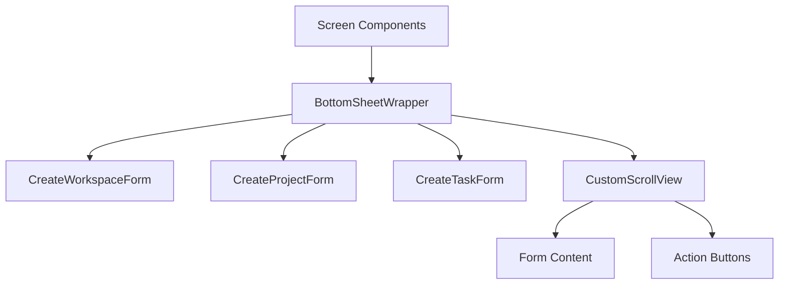

# Bottom Sheet Modal Implementation for Creation Forms

## Overview

This document outlines the design and implementation plan for replacing the current dialog-based creation forms with bottom sheet modals for creating workspaces, projects, and tasks throughout the TaskFlow application. This change will provide a more modern and consistent user experience across all creation flows.

The implementation will affect:
- Workspace creation in `WorkspaceListScreen` and `MainScreen`
- Project creation in `ProjectsScreen` and `MainScreen`
- Task creation in `TasksScreen`

## Current Implementation Analysis

### Workspace Creation
- Currently implemented using `showDialog` with `AlertDialog` in `WorkspaceListScreen` and `MainScreen`
- Uses `CreateWorkspaceForm` widget
- Triggered from FAB and app bar actions

### Project Creation
- Currently implemented using `showDialog` with `AlertDialog` in `ProjectsScreen` and `MainScreen`
- Uses `CreateProjectForm` widget with workspace selection dropdown
- Triggered from FAB and app bar actions

### Task Creation
- Currently implemented using `showDialog` with `AlertDialog` in `TasksScreen`
- Uses `CreateTaskForm` widget with workspace and project selection
- Triggered from FAB

## Proposed Solution

Replace all `showDialog` implementations with `showModalBottomSheet` for a consistent bottom sheet experience. This will involve:

1. Creating a reusable bottom sheet wrapper component
2. Updating all screen components to use bottom sheets instead of dialogs
3. Ensuring proper form validation and submission handling
4. Maintaining existing functionality while improving UX

## Architecture

### Component Structure

### Bottom Sheet Wrapper Component

Create a reusable `BottomSheetWrapper` widget in `lib/shared/widgets/bottom_sheet_wrapper.dart` that will:

1. Provide consistent styling and behavior for all creation forms
2. Handle scrollable content properly
3. Include consistent action buttons (Cancel/Create)
4. Manage form submission and validation

The wrapper will include:
- A draggable handle at the top for better UX
- A title bar with close button
- Support for keyboard-aware padding
- Consistent styling with the app theme
- Responsive layout that works on all screen sizes
- Proper handling of form validation states

Key implementation details:
- Use `Flexible` widget to ensure proper height management
- Implement `SingleChildScrollView` for content scrolling
- Add theme-aware styling for light/dark modes
- Include proper padding and spacing
- Handle button states based on form validation

## Implementation Details

### Form Integration Approach

All forms will be integrated with the bottom sheet wrapper while maintaining their existing functionality. The existing dialog methods will be completely replaced with bottom sheet implementations. The key integration points are:

1. **Form Validation**: Each form will maintain its own validation logic
2. **Submission Handling**: Forms will continue to use their existing `onCreate` callbacks
3. **State Management**: Forms will maintain their local state for text controllers and selections
4. **Error Handling**: Error handling patterns will remain consistent

### 1. Workspace Creation Bottom Sheet

In `WorkspaceListScreen` and `MainScreen`, completely replace `_showCreateWorkspaceDialog` with `_showCreateWorkspaceBottomSheet`:

Replacement changes:
- DELETE the existing `_showCreateWorkspaceDialog` method
- CREATE a new `_showCreateWorkspaceBottomSheet` method
- Use `showModalBottomSheet` instead of `showDialog`
- Set `isScrollControlled: true` for proper keyboard handling
- Add padding for keyboard insets using `MediaQuery.of(context).viewInsets.bottom`
- Wrap content in the new `BottomSheetWrapper`
- REMOVE the AlertDialog wrapper entirely
- Maintain existing form validation and submission logic

### 2. Project Creation Bottom Sheet

In `ProjectsScreen` and `MainScreen`, completely replace `_showCreateProjectDialog` with `_showCreateProjectBottomSheet`:

Replacement changes:
- DELETE the existing `_showCreateProjectDialog` method
- CREATE a new `_showCreateProjectBottomSheet` method
- Use `showModalBottomSheet` instead of `showDialog`
- Set `isScrollControlled: true` for proper keyboard handling
- Add padding for keyboard insets using `MediaQuery.of(context).viewInsets.bottom`
- Wrap content in the new `BottomSheetWrapper`
- REMOVE the AlertDialog wrapper entirely
- Maintain workspace selection dropdown functionality
- Preserve existing project creation workflow

### 3. Task Creation Bottom Sheet

In `TasksScreen`, completely replace `_showCreateTaskDialog` with `_showCreateTaskBottomSheet`:

Replacement changes:
- DELETE the existing `_showCreateTaskDialog` method
- CREATE a new `_showCreateTaskBottomSheet` method
- Use `showModalBottomSheet` instead of `showDialog`
- Set `isScrollControlled: true` for proper keyboard handling
- Add padding for keyboard insets using `MediaQuery.of(context).viewInsets.bottom`
- Wrap content in the new `BottomSheetWrapper`
- REMOVE the AlertDialog wrapper entirely
- Maintain workspace and project selection workflows
- Keep existing multi-step selection process

## Files to be Modified

### 1. Screen Components (Modify existing files)
- `lib/features/workspace/presentation/screens/workspace_list_screen.dart`
  - Replace `_showCreateWorkspaceDialog` with `_showCreateWorkspaceBottomSheet`
  - Update FAB and app bar button onPressed handlers
- `lib/features/project/presentation/screens/projects_screen.dart`
  - Replace `_showCreateProjectDialog` with `_showCreateProjectBottomSheet`
  - Update FAB and app bar button onPressed handlers
- `lib/features/task/presentation/screens/tasks_screen.dart`
  - Replace `_showCreateTaskDialog` with `_showCreateTaskBottomSheet`
  - Update FAB and app bar button onPressed handlers
- `lib/features/main/presentation/screens/main_screen.dart`
  - Replace `_showCreateWorkspaceDialog` and `_showCreateProjectDialog` with bottom sheet equivalents
  - Update FAB onPressed handlers based on current screen

### 2. New Component (Create new file)
- `lib/shared/widgets/bottom_sheet_wrapper.dart`

## UI/UX Improvements

### Benefits of Bottom Sheet Implementation
1. **Consistent Experience**: Unified creation flow across all entity types
2. **Better Mobile Experience**: More natural interaction pattern for mobile users
3. **Improved Accessibility**: Easier to reach and interact with on mobile devices
4. **Visual Consistency**: Modern UI pattern that aligns with current design trends

### Design Considerations
1. **Height Management**: Bottom sheets will resize based on content using `isScrollControlled: true`
2. **Keyboard Handling**: Proper padding when keyboard appears using `MediaQuery.of(context).viewInsets.bottom`
3. **Scroll Behavior**: Smooth scrolling for forms with many fields using `SingleChildScrollView`
4. **Action Placement**: Consistent placement of action buttons in the bottom sheet footer
5. **Gestures**: Support for dragging to dismiss with proper animation
6. **Theming**: Consistent with app theme and dark mode support

### Backward Compatibility
1. **Functionality**: All existing creation workflows will be preserved
2. **Data Flow**: No changes to how data flows between forms and services
3. **User Experience**: Improved interaction patterns while maintaining familiar workflows
4. **Error Handling**: Existing error handling patterns will be maintained

## State Management

The implementation will maintain the existing state management patterns using:
- Flutter Bloc for authentication state
- Direct service calls for data operations
- Local state management for form fields and selections

No changes to the underlying state management approach are required.

## Error Handling

Error handling will remain consistent with the current implementation:
- Form validation within each creation form
- Snackbar notifications for success/error messages
- Proper error propagation from services to UI
- Maintain existing try/catch patterns in async operations

## Testing Strategy

### Unit Tests
1. Test form validation in each creation form
2. Test bottom sheet wrapper component
3. Test form submission flows
4. Test keyboard handling behavior

### Widget Tests
1. Test bottom sheet display and behavior
2. Test form interaction within bottom sheets
3. Test action button functionality
4. Test drag to dismiss functionality
5. Test theme consistency

### Integration Tests
1. Test end-to-end creation flows
2. Test error scenarios and user feedback
3. Test cross-screen navigation after creation
4. Test data persistence after creation
5. **Verification Tests**: Confirm old dialog methods are completely removed and not called anywhere
6. **Usage Tests**: Verify all UI triggers (FABs, buttons) call the new bottom sheet methods

## Migration Plan

### Phase 1: Component Creation
1. Create `BottomSheetWrapper` component in `lib/shared/widgets/bottom_sheet_wrapper.dart`
2. Test component in isolation

### Phase 2: Implementation (Replace, Don't Update)
1. Replace dialog implementation in `WorkspaceListScreen` with bottom sheet for workspace creation
2. Replace dialog implementation in `ProjectsScreen` with bottom sheet for project creation
3. Replace dialog implementation in `TasksScreen` with bottom sheet for task creation
4. Replace dialog implementation in `MainScreen` with bottom sheets for all creation flows
5. Remove all existing `_showDialog` methods
6. Ensure all FAB and action button triggers call the new bottom sheet methods

### Phase 3: Testing and Refinement
1. Conduct unit and widget tests for the new component
2. Perform manual testing on all supported devices
3. Verify all creation flows work correctly
4. Refine UI/UX based on testing feedback
5. Remove any unused dialog-related code
6. Run `flutter analyze` to ensure no new static analysis issues
7. Run `flutter test` to ensure all tests pass

## Performance Considerations

1. **Memory Management**: Proper disposal of controllers and resources
2. **Rendering Performance**: Efficient widget rebuilding
3. **Network Calls**: Maintaining existing service layer performance

## Code Quality and Analysis

To ensure high code quality and catch bugs early during implementation:

1. **Run Flutter Analyzer Frequently**: Execute `flutter analyze` after each significant code change
2. **Address All Issues**: Fix all analyzer warnings and errors before proceeding
3. **Follow Dart Best Practices**: Adhere to Dart style guide and Flutter lint rules
4. **Code Review**: Perform self-review of changes before committing
5. **Static Analysis**: Ensure no new static analysis issues are introduced

## Edge Cases and Special Considerations

1. **Screen Size Variations**: Bottom sheets will work on all device sizes
2. **Orientation Changes**: Proper handling of device rotation
3. **Keyboard Interactions**: Graceful handling of keyboard show/hide
4. **Form Validation States**: Proper handling of validation errors in bottom sheets
5. **Loading States**: Maintaining existing loading indicators and feedback
6. **Navigation**: Proper navigation after successful creation
7. **Error States**: Consistent error handling and user feedback

## Ensuring Implementation Usage

To ensure the new bottom sheet implementation is actually used and the old dialog logic is completely removed:

1. **Code Removal**: Explicitly delete all `_showDialog` methods
2. **Method Replacement**: Replace all calls to dialog methods with calls to bottom sheet methods
3. **UI Trigger Updates**: Update FAB and button onPressed handlers to call new bottom sheet methods
4. **Verification**: Search codebase to ensure no references to old dialog methods remain
5. **Testing**: Verify through manual testing that all creation flows use bottom sheets

### Verification Steps

After implementation, verify the replacement by:

1. Searching for `_showCreateWorkspaceDialog`, `_showCreateProjectDialog`, `_showCreateTaskDialog` - should return 0 matches
2. Searching for `showDialog` in the modified files - should return 0 matches for creation flows
3. Searching for `_showCreateWorkspaceBottomSheet`, `_showCreateProjectBottomSheet`, `_showCreateTaskBottomSheet` - should return expected matches
4. Manual testing of all creation flows to confirm bottom sheets are used
5. Run `flutter analyze` and ensure no new analyzer issues are introduced
6. Run `flutter test` to ensure all tests pass

## Dependencies

The implementation will use:
- Flutter's built-in `showModalBottomSheet`
- Existing form widgets (`CreateWorkspaceForm`, `CreateProjectForm`, `CreateTaskForm`)
- Existing service layers (`WorkspaceService`, `ProjectService`, `TaskService`)
- Existing state management patterns (Flutter Bloc)
- Existing navigation patterns (`Navigator.push`, `Navigator.pop`)

## Theming and Styling Consistency

The bottom sheet implementation will:
1. Use existing app theme definitions
2. Maintain consistency with dark/light mode
3. Follow Material Design guidelines for bottom sheets
4. Use consistent spacing and typography
5. Maintain existing color schemes and branding

## Conclusion

This implementation will modernize the TaskFlow application by completely replacing traditional dialogs with bottom sheet modals for all creation workflows. The change will provide a more consistent and mobile-friendly user experience while maintaining all existing functionality. The implementation approach focuses on:

1. **Complete Replacement**: Removing all existing dialog implementations
2. **Consistent User Experience**: Unified bottom sheet approach across all creation flows
3. **Backward Compatibility**: Maintaining all existing functionality
4. **Code Quality**: Ensuring the new implementation is actually used and the old code is removed