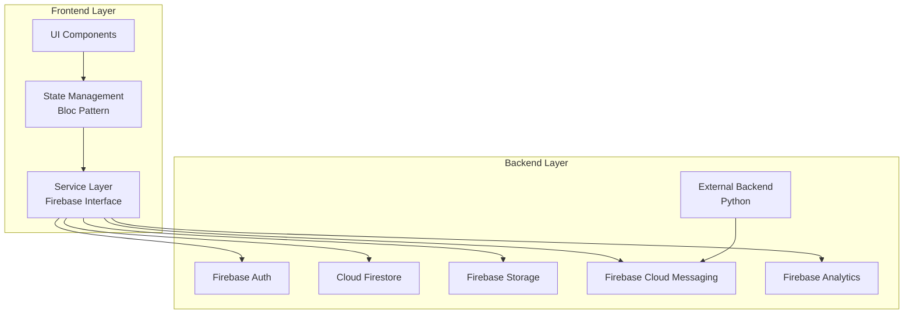
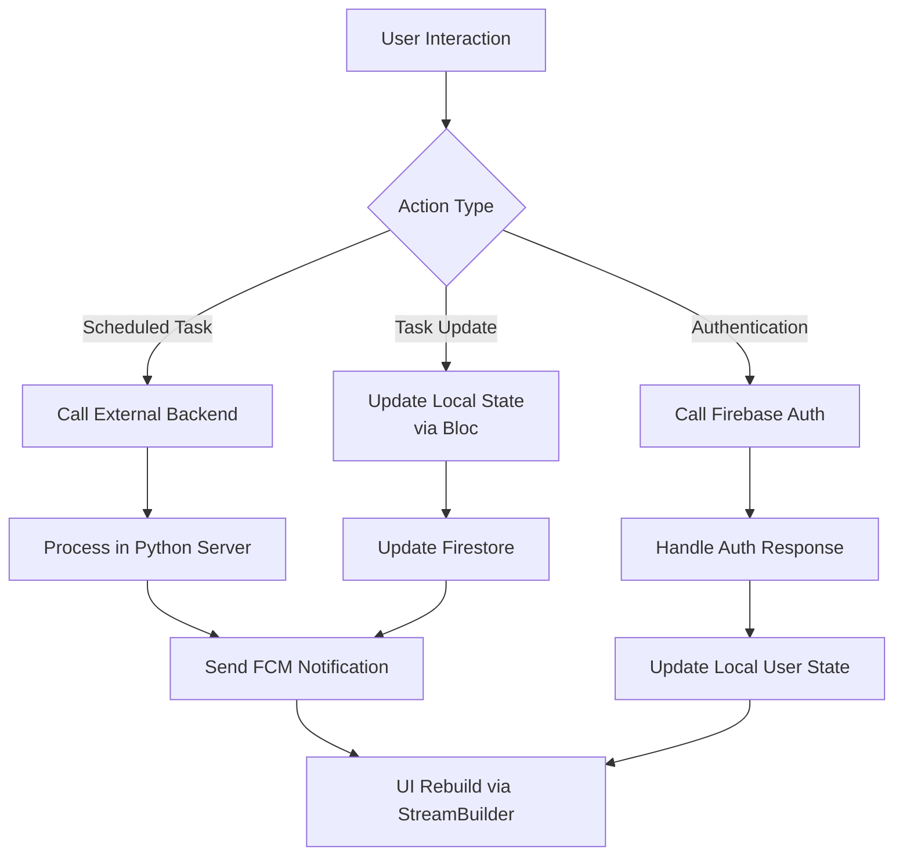
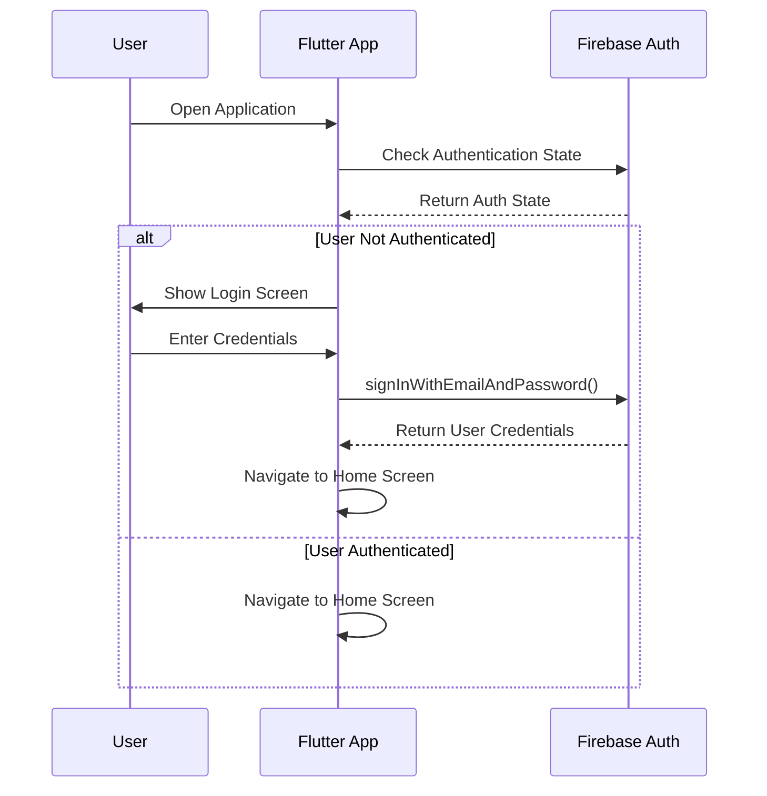
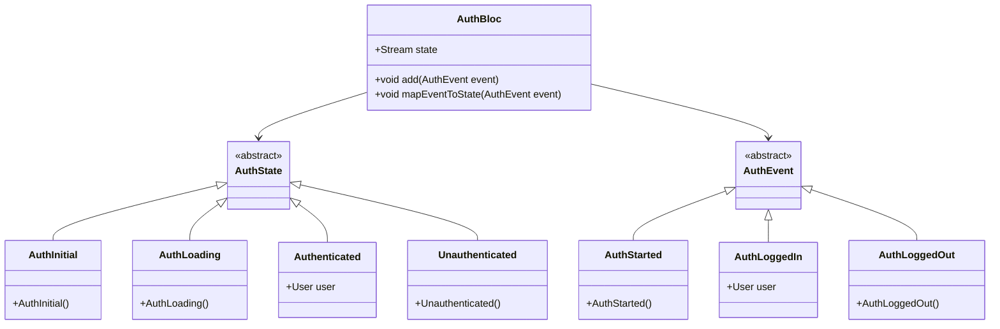

# TaskFlow - Team Productivity & Project Management App Implementation Design

## 1. Overview

TaskFlow is a collaborative project management application built with Flutter and Firebase, designed to help teams organize and track their work through an intuitive Kanban-style interface. The application will implement a comprehensive set of features including user authentication, workspace management, real-time task tracking, role-based access control, and push notifications. Server-side logic will be handled through a separate Python backend instead of Firebase Cloud Functions, providing more flexibility and control over business logic implementation.

### 1.1 Key Features
- User authentication with email/password and Google Sign-In
- User profile management with profile picture upload
- Workspace creation and team member invitations
- Real-time Kanban board with drag-and-drop task management
- Role-based access control (Admin/Member permissions)
- Push notifications for task assignments and updates
- Analytics for tracking user engagement
- Scheduled tasks and background processing through Python backend

### 1.2 Technology Stack
- **Frontend**: Flutter SDK with Material Design
- **State Management**: Bloc pattern for scalable state management
- **Backend**: Firebase services (Auth, Firestore, Storage, Cloud Messaging)
- **External Backend**: Python Flask/FastAPI for server-side logic
- **Analytics**: Firebase Analytics and Performance Monitoring

### 1.3 Firebase Setup Requirements
Based on the project analysis, Firebase is partially configured but requires:
- Firebase project configuration files (google-services.json for Android, GoogleService-Info.plist for iOS)
- Firebase initialization in the Flutter application
- Proper Firebase service dependencies in pubspec.yaml

### 1.4 Firebase Configuration Process
1. Create a new Firebase project in the Firebase Console
2. Add Android app to the Firebase project with package name `com.pranta.taskflow`
3. Download and add `google-services.json` to `android/app/` directory
4. Add iOS app to the Firebase project
5. Download and add `GoogleService-Info.plist` to `ios/Runner/` directory
6. Install FlutterFire CLI: `dart pub global activate flutterfire_cli`
7. Configure FlutterFire: `flutterfire configure`
8. Update pubspec.yaml with required Firebase dependencies
9. Generate and download service account key for Firebase Admin SDK
10. Configure Firebase Admin SDK in Python backend

## 2. Architecture

The application follows a layered architecture pattern with clear separation between presentation, business logic, and data layers. The architecture is designed to support real-time data synchronization and scalable cloud-based functionality.



### 2.1 Data Flow Architecture


## 3. Component Architecture

### 3.1 Feature-Based Folder Structure
The application will be organized using a feature-based structure for better maintainability and scalability:

```
lib/
├── main.dart
├── firebase_options.dart
├── core/
│   ├── constants/
│   ├── utils/
│   └── themes/
├── features/
│   ├── auth/
│   ├── profile/
│   ├── workspace/
│   ├── project/
│   └── task/
├── shared/
│   ├── models/
│   ├── widgets/
│   └── services/
└── routes/
```

### 3.2 Core Components

#### 3.2.1 Authentication Flow


#### 3.2.2 State Management with Bloc
The application will use the Bloc pattern for state management, with each feature having its own Bloc:



## 4. Data Models & Firestore Structure

### 4.1 Entity Relationship Diagram
``mermaid
erDiagram
USER {
string uid PK
string email
string displayName
string photoURL
}
WORKSPACE {
string id PK
string name
string ownerId FK
timestamp createdAt
}
WORKSPACE_MEMBER {
string workspaceId PK, FK
string userId PK, FK
string role
timestamp joinedAt
}
PROJECT {
string id PK
string workspaceId FK
string name
string description
timestamp createdAt
string ownerId FK
}
TASK {
string id PK
string projectId FK
string title
string description
string status
string assigneeId
string reporterId
datetime dueDate
string priority
timestamp createdAt
timestamp updatedAt
}
USER ||--o{ WORKSPACE : "creates"
USER ||--o{ WORKSPACE_MEMBER : "is_member_of"
WORKSPACE ||--o{ WORKSPACE_MEMBER : "has_members"
WORKSPACE ||--o{ PROJECT : "contains"
PROJECT ||--o{ TASK : "contains"
USER ||--o{ TASK : "assigns"
USER ||--o{ TASK : "reports"
```

### 4.2 Firestore Collections Structure
- **users/** - User profiles
- **workspaces/** - Workspace documents
  - **members/** - Subcollection for workspace members
  - **projects/** - Subcollection for projects
    - **tasks/** - Subcollection for tasks

## 5. Business Logic Layer

### 5.1 Authentication Logic
- Email/password authentication
- Google Sign-In integration
- User state persistence
- Password reset flow

### 5.2 Workspace Management
- Creating new workspaces
- Inviting members via email
- Managing member roles
- Leaving workspaces

### 5.3 Task Management
- Creating, updating, and deleting tasks
- Drag-and-drop functionality between columns
- Real-time synchronization across clients
- Task assignment and notifications

### 5.4 Role-Based Access Control
- Admin permissions (workspace creator)
- Member permissions (limited access)
- Security rules enforcement

## 6. UI/UX Design

### 6.1 Screen Hierarchy
- Splash Screen
- Authentication Screens (Login/Signup)
- Onboarding/Profile Setup
- Workspace Dashboard
- Project View (Kanban Board)
- Task Detail View
- User Profile

### 6.2 Kanban Board Implementation
``mermaid
classDiagram
class KanbanBoard {
+List<Column> columns
+StreamSubscription taskSubscription
+initRealTimeListener()
+updateTaskStatus()
}
class TaskColumn {
+String title
+List<Task> tasks
+renderColumn()
}
class Task {
+String id
+String title
+String description
+String status
+String assigneeId
+DateTime dueDate
+Priority priority
+renderCard()
}
class TaskService {
+Firestore firestore
+Stream<List<Task>> getTasksByProject(projectId)
+Future<void> updateTask(task)
+Future<void> createTask(task)
}
KanbanBoard --> TaskColumn : "contains"
TaskColumn --> Task : "contains"
KanbanBoard --> TaskService : "uses"
TaskService --> Firestore : "communicates with"
```

### 6.3 Drag-and-Drop Implementation
The drag-and-drop functionality will be implemented using Flutter's `Draggable` and `DragTarget` widgets:
- Tasks will be wrapped in `Draggable` widgets
- Columns will be implemented as `DragTarget` widgets
- Upon drop, the task status will be updated in Firestore
- Real-time listeners will update all clients with the new task status

## 7. Firebase Integration

### 7.1 Firebase Authentication
- Implementation of email/password authentication
- Google Sign-In integration using Firebase Auth
- User state management with StreamBuilder
- Password reset functionality

### 7.2 Cloud Firestore
- Real-time listeners for instant UI updates
- Efficient querying for task and project data
- Offline persistence for improved user experience
- Data validation and security rules

### 7.3 Firebase Storage
- Profile picture upload and storage
- Image compression for optimal performance
- Secure download URLs for profile images

### 7.4 Firebase Cloud Messaging
- Push notifications for task assignments
- Background and foreground notification handling
- Device token management

### 7.5 Alternative Approaches for Server-Side Logic
Instead of using Firebase Cloud Functions, server-side logic will be handled through a Python Flask/FastAPI backend service for handling notifications, data processing, and scheduled tasks.

For handling scheduled messages and background tasks without Firebase Cloud Functions:

**Python Approach:**
1. Create a Python Flask/FastAPI application
2. Use APScheduler for job scheduling
3. Use Firebase Admin SDK for Python to send FCM notifications
4. Deploy to Heroku, AWS, or Google Cloud Run

### 7.6 Firebase Security Rules
The Firebase security rules for workspaces will implement version 2 of the rules language. They will ensure that only authenticated users can read or write workspace documents, and that users can only access workspaces where they are members. For workspace members, read access will be allowed for all authenticated users, while write access will be restricted based on user roles, with admins having broader permissions than regular members.

Since we're not using Cloud Functions, security rules become even more important to ensure data integrity and prevent unauthorized access to sensitive operations like user management and task assignments.

## 8. Testing Strategy

### 8.1 Unit Testing
- Testing individual Bloc logic
- Testing service layer methods
- Testing data models and transformations

### 8.2 Widget Testing
- Testing UI components in isolation
- Testing user interactions and state changes
- Testing form validation and error handling

### 8.3 Integration Testing
- Testing complete user workflows
- Testing Firebase integration
- Testing real-time data synchronization

## 9. Implementation Roadmap

### Phase 1: Foundation
1. Complete Firebase setup (add configuration files and initialize Firebase)
2. Update pubspec.yaml with required Firebase dependencies
3. Implement feature-based folder structure
4. Create core models and data classes
5. Set up routing and navigation

### Phase 2: Authentication
1. Implement Firebase Auth service
2. Create login/signup screens
3. Add Google Sign-In functionality
4. Implement authentication state persistence

### Phase 3: User Profile
1. Create profile setup screen
2. Implement profile picture upload to Firebase Storage
3. Store user data in Firestore

### Phase 4: Workspace Management
1. Create workspace dashboard
2. Implement workspace creation
3. Add member invitation functionality
4. Implement role-based access control

### Phase 5: Task Management
1. Design Kanban board interface
2. Implement drag-and-drop functionality
3. Add real-time listeners for task updates
4. Create task detail view

### Phase 6: Notifications & Analytics
1. Set up Firebase Cloud Messaging
2. Implement notification handling
3. Add Firebase Analytics event tracking
4. Integrate performance monitoring

### Phase 7: Python Backend Development
1. Create Python backend project structure with virtual environment
2. Extract Firebase configuration from Flutter project
3. Implement Firebase Admin SDK integration
4. Create API endpoints for complex operations
5. Set up job scheduling for background tasks
6. Implement FCM notification service
7. Test backend API endpoints

### Phase 8: Integration & Testing
1. Integrate Flutter frontend with Python backend
2. Test end-to-end workflows
3. Perform security testing
4. Optimize performance

### Phase 9: Polish & Optimization
1. UI/UX refinements
2. Performance optimization
3. Accessibility improvements
4. Final testing and bug fixes

## 10. Firebase Setup Implementation
The Firebase setup will involve:

### 10.1 Firebase Initialization
The Firebase initialization will be implemented in the main.dart file by ensuring the Flutter binding is initialized, then calling Firebase.initializeApp with the platform-specific options, and finally running the MyApp widget.

### 10.2 Required Dependencies
The required Firebase dependencies will be added to pubspec.yaml including firebase_core, firebase_auth, cloud_firestore, firebase_storage, firebase_messaging, firebase_analytics, and firebase_performance with their respective versions.

### 10.3 Configuration Files
Add platform-specific configuration files:
- `android/app/google-services.json` for Android
- `ios/Runner/GoogleService-Info.plist` for iOS

## 11. State Management with Bloc

### 11.1 Bloc Architecture
The application will use the Bloc pattern for state management, which provides a clear separation between business logic and presentation layers. Each feature will have its own Bloc responsible for managing its state.

### 11.2 Feature Blocs
- **AuthBloc**: Manages authentication state (login, signup, logout)
- **UserBloc**: Manages user profile data
- **WorkspaceBloc**: Manages workspace data and member management
- **ProjectBloc**: Manages project data within workspaces
- **TaskBloc**: Manages task data and real-time updates

### 11.3 Bloc Implementation
The AuthBloc implementation will extend the Bloc class with AuthEvent as the event type and AuthState as the state type. It will have an AuthService dependency and implement handlers for different authentication events such as AuthStarted, AuthLoggedIn, and AuthLoggedOut. The _onAuthStarted handler will check the current user authentication state and emit the appropriate state.

## 12. UI/UX Design Principles

### 12.1 Design System
The application will follow Material Design principles with a clean, modern interface that prioritizes usability and visual appeal. The color scheme will be professional yet vibrant, using a primary color palette of blues and purples with accent colors for status indicators.

### 12.2 Responsive Design
The UI will be designed to work seamlessly across different device sizes:
- Mobile-first approach for smartphones
- Adaptive layouts for tablets
- Desktop-optimized views for larger screens

### 12.3 Accessibility
The application will follow accessibility best practices:
- Proper contrast ratios for text and background colors
- Semantic HTML structure for screen readers
- Keyboard navigation support
- Support for dynamic text sizing

### 12.4 Performance Optimization
UI performance will be optimized through:
- Efficient widget rebuilding with Bloc pattern
- Lazy loading of data in lists
- Image caching for profile pictures
- Proper disposal of resources and listeners

## 13. Development Best Practices

### 13.1 Code Quality
- Run `flutter analyze` frequently to catch bugs early in the development process
- Follow Flutter linting rules and best practices
- Use consistent naming conventions for files, classes, and variables
- Write descriptive comments for complex logic
- Address all analyzer warnings and errors before committing code

### 13.2 Testing
- Write unit tests for business logic and Bloc implementations
- Create widget tests for UI components
- Perform integration testing for critical user flows
- Use mock data for testing Firebase interactions

### 13.3 Performance Monitoring
- Monitor app performance using Firebase Performance Monitoring
- Optimize widget rebuilds and minimize unnecessary state changes
- Implement proper error handling and logging
- Profile the app regularly to identify performance bottlenecks

## 14. External Backend Implementation

A Python backend will be implemented using Flask or FastAPI to handle server-side logic that would typically be handled by Firebase Cloud Functions:

1. **Project Setup**
   - Create a Python virtual environment
   - Install Flask/FastAPI and Firebase Admin SDK
   - Set up project structure with proper modules

2. **Task Scheduling**
   - Use APScheduler for job scheduling
   - Implement background tasks with threading or multiprocessing
   - Add logging and monitoring capabilities

3. **API Development**
   - Create RESTful endpoints for business logic
   - Implement JWT token validation for Firebase authentication
   - Add request validation and error handling

4. **Firebase Integration**
   - Use Firebase Admin SDK for Python to send notifications
   - Implement database operations for complex business logic
   - Handle authentication token verification

## 15. Python Backend Project Structure

The Python backend project will be created in a separate directory within the Flutter project and will include the following structure:

```
python_backend/
├── venv/                 # Python virtual environment
├── app/
│   ├── __init__.py       # Package initialization
│   ├── main.py           # Application entry point
│   ├── config.py         # Configuration settings
│   ├── models/           # Data models
│   ├── api/              # API endpoints
│   │   ├── __init__.py
│   │   ├── routes.py     # API route definitions
│   │   └── controllers.py # Business logic controllers
│   ├── services/         # External service integrations
│   │   ├── __init__.py
│   │   ├── firebase_service.py # Firebase Admin SDK integration
│   │   └── notification_service.py # FCM notification handling
│   ├── utils/            # Utility functions
│   │   ├── __init__.py
│   │   └── helpers.py
│   └── tasks/            # Background task scheduling
│       ├── __init__.py
│       └── scheduler.py  # APScheduler implementation
├── requirements.txt      # Python dependencies
├── .env                  # Environment variables
└── README.md             # Project documentation
```

## 16. Firebase Configuration for Python Backend

The Python backend will use the Firebase Admin SDK to interact with Firebase services. It will require:

1. **Service Account Key**: A JSON file with Firebase service account credentials
2. **Environment Variables**: Configuration settings for Firebase project ID and other parameters
3. **Firebase Admin SDK Initialization**: Proper initialization of the Firebase Admin SDK in the Python application

The Firebase configuration data will be extracted from the Flutter project's Firebase configuration and used to set up the Python backend.

## 17. Python Backend Implementation Plan

### 17.1 Project Setup
1. Create a new directory `python_backend` in the project root
2. Set up a Python virtual environment: `python -m venv venv`
3. Activate the virtual environment: `source venv/bin/activate` (Linux/Mac) or `venv\Scripts\activate` (Windows)
4. Install required packages:
   - `fastapi` or `flask` for web framework
   - `firebase-admin` for Firebase integration
   - `python-dotenv` for environment variable management
   - `apscheduler` for task scheduling
   - `uvicorn` for ASGI server (if using FastAPI)

### 17.2 Firebase Integration
1. Extract Firebase configuration from Flutter project
2. Create a service account key in Firebase Console
3. Implement Firebase Admin SDK initialization
4. Create service classes for Firebase operations

### 17.3 API Development
1. Implement RESTful endpoints for task management
2. Add authentication middleware for Firebase token validation
3. Create controllers for business logic
4. Implement error handling and validation

### 17.4 Task Scheduling
1. Set up APScheduler for background tasks
2. Implement scheduled jobs for notifications
3. Add logging and monitoring for scheduled tasks

### 17.5 Notification Service
1. Implement FCM notification sending
2. Create notification templates for different events
3. Add device token management

## 18. Firebase Configuration Extraction

To set up the Python backend, Firebase configuration data needs to be extracted from the Flutter project:

### 18.1 Required Firebase Configuration Data
1. **Project ID**: The unique identifier for the Firebase project
2. **API Key**: The web API key for the Firebase project
3. **Auth Domain**: The domain for authentication
4. **Database URL**: The URL for the Realtime Database (if used)
5. **Storage Bucket**: The storage bucket name
6. **Messaging Sender ID**: The sender ID for Firebase Cloud Messaging
7. **App ID**: The application identifier
8. **Measurement ID**: The identifier for Google Analytics (if used)

### 18.2 Service Account Key Generation
1. Go to Firebase Console > Project Settings > Service Accounts
2. Click "Generate new private key"
3. Save the JSON file securely
4. Use this file to initialize the Firebase Admin SDK in the Python backend

### 18.3 Environment Variables Setup
The extracted configuration data should be stored as environment variables in the Python backend:

- FIREBASE_PROJECT_ID: your-project-id
- FIREBASE_PRIVATE_KEY_ID: your-private-key-id
- FIREBASE_PRIVATE_KEY: your-private-key
- FIREBASE_CLIENT_EMAIL: your-client-email
- FIREBASE_CLIENT_ID: your-client-id
- FIREBASE_AUTH_URI: your-auth-uri
- FIREBASE_TOKEN_URI: your-token-uri
- FIREBASE_AUTH_PROVIDER_X509_CERT_URL: your-auth-provider-cert-url
- FIREBASE_CLIENT_X509_CERT_URL: your-client-cert-url

Note: The actual implementation will involve creating the Python backend project with proper security measures for handling these credentials.

## 19. Python Backend Implementation Files

### 19.1 Requirements File
The `requirements.txt` file will include all necessary Python dependencies:

- fastapi: Web framework for building APIs
- uvicorn: ASGI server for running FastAPI applications
- firebase-admin: Firebase Admin SDK for Python
- python-dotenv: Library for loading environment variables
- apscheduler: Advanced Python Scheduler for background tasks
- pydantic: Data validation and settings management

### 19.2 Main Application File
The `main.py` file will serve as the entry point for the Python backend application, setting up the FastAPI application, loading environment variables, and initializing the Firebase Admin SDK.

### 19.3 Firebase Service Implementation
The `firebase_service.py` file will contain the Firebase Admin SDK initialization and wrapper functions for common Firebase operations such as sending FCM notifications, database operations, and authentication token verification.

### 19.4 Notification Service
The `notification_service.py` file will implement the logic for sending push notifications to users, including creating notification payloads, managing device tokens, and handling different notification types.

### 19.5 Task Scheduler
The `scheduler.py` file will implement the APScheduler configuration for running background tasks such as sending scheduled notifications, cleaning up old data, and performing periodic maintenance operations.

### 19.6 API Routes
The `routes.py` file will define the RESTful API endpoints for the backend, including endpoints for task management, user operations, and system administration.

### 19.7 Controllers
The `controllers.py` file will contain the business logic for handling API requests, processing data, and coordinating between different services.

## 20. Python Backend Development Workflow

### 20.1 Development Environment Setup
1. Create a Python virtual environment in the `python_backend` directory
2. Install dependencies from `requirements.txt`
3. Set up environment variables in `.env` file
4. Configure IDE/editor with Python support and linting

### 20.2 Development Process
1. Run the development server with auto-reload: `uvicorn app.main:app --reload`
2. Implement features incrementally following test-driven development
3. Write unit tests for each module
4. Use `pytest` for running tests
5. Run `flake8` or `black` for code formatting and linting

### 20.3 Testing Strategy
1. Unit testing for individual functions and classes
2. Integration testing for API endpoints
3. End-to-end testing for complete workflows
4. Load testing for performance evaluation

### 20.4 Deployment Process
1. Create production-ready build
2. Set up environment variables for production
3. Deploy to cloud platform (Heroku, AWS, Google Cloud Run)
4. Configure domain and SSL certificates
5. Set up monitoring and logging
