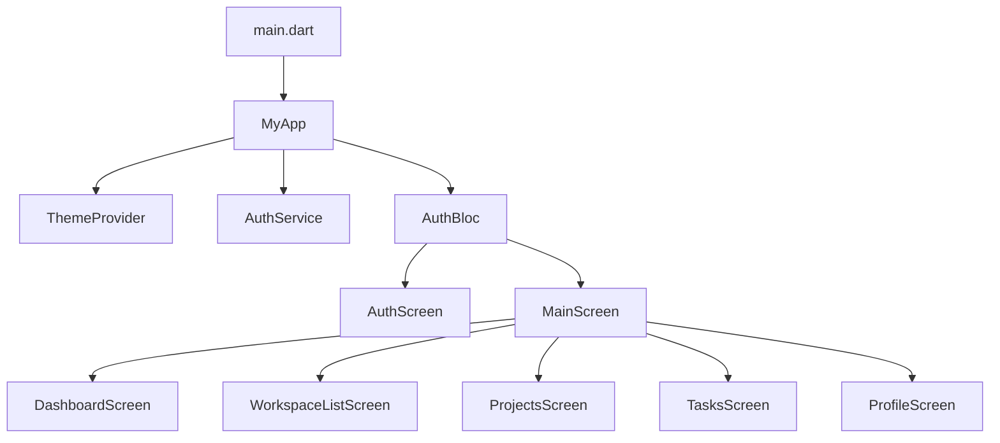
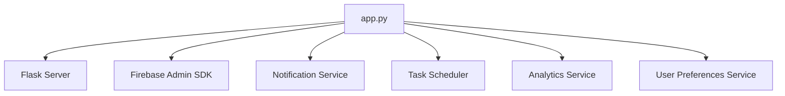
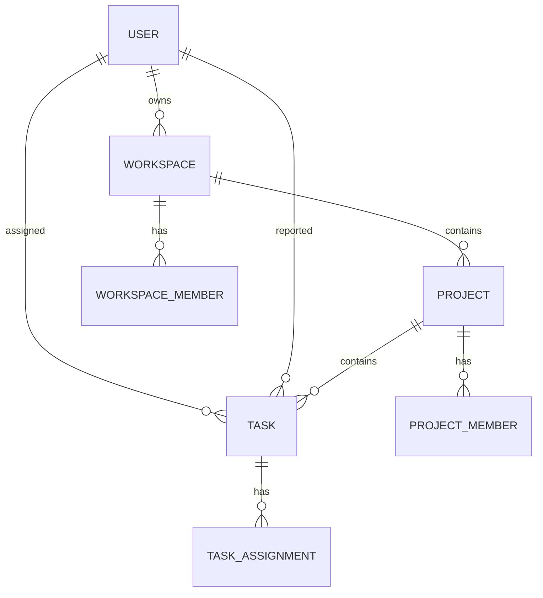

# TaskFlow Project Audit and Optimization Plan

## 1. Overview

This document outlines a comprehensive audit and optimization plan for the TaskFlow project, a collaborative project management application built with Flutter and Firebase. The audit will cover all aspects of the application from code quality, architecture, performance, security, and implementation completeness.

## 2. Project Architecture

### 2.1 Frontend Architecture (Flutter)



### 2.2 Backend Architecture (Python Flask)



### 2.3 Data Models



## 3. Current Implementation Status

### 3.1 Core Features
- ✅ Authentication System (Email/Password, Google Sign-In)
- ✅ User Profile Management
- ✅ Workspace Management
- ✅ Project Management
- ✅ Task Management with Kanban Board
- ✅ Role-Based Access Control
- ✅ Push Notifications
- ✅ Analytics & Performance Monitoring

### 3.2 Technical Implementation
- ✅ Feature-based folder structure
- ✅ Firebase services integration
- ✅ Flutter Bloc pattern for state management
- ✅ Python backend with Flask
- ✅ Service layer architecture with repository pattern

## 4. Audit Findings

### 4.1 Code Quality Analysis

#### 4.1.1 Logger Implementation
The project already has a logger implementation that only runs in debug mode:

```dart
import 'package:flutter/foundation.dart';

class Logger {
  static void debug(String message) {
    if (kDebugMode) {
      print('[DEBUG] $message');
    }
  }
  
  static void info(String message) {
    if (kDebugMode) {
      print('[INFO] $message');
    }
  }
  
  static void error(String message) {
    if (kDebugMode) {
      print('[ERROR] $message');
    }
  }
}
```

This implementation correctly ensures that logging only occurs in debug mode, which is good for performance in production.

#### 4.1.2 State Management
The project uses a combination of:
- Flutter Bloc for authentication state
- ValueNotifier for cross-screen communication
- Provider for theme management

This is a well-structured approach that separates concerns appropriately.

#### 4.1.3 Service Layer Architecture
Services are well-organized with:
- Base service containing common functionality
- Specific services for each domain (Auth, User, Workspace, Project, Task)
- Proper error handling and logging in each service

### 4.2 Existing Issues Found

Based on the analysis files, several issues were identified that need to be addressed:

#### 4.2.1 BuildContext Usage Across Async Gaps
Multiple files have the issue of using `BuildContext` across async gaps with unrelated `mounted` checks. This is a common Flutter issue that can lead to errors when the widget is disposed before the async operation completes.

Example from `main_screen.dart`:
```dart
final workspaces = await workspaceService.getUserWorkspaces(user.uid);

if (workspaces.isEmpty) {
  if (context.mounted) { // This is the wrong context check
    ScaffoldMessenger.of(context).showSnackBar(
      const SnackBar(
        content: Text('Please create a workspace first'),
        backgroundColor: Colors.orange,
      ),
    );
  }
  return;
}
```

#### 4.2.2 String Interpolation Issues
In `user_service_enhanced.dart`, there are instances where string concatenation is used instead of interpolation:

```dart
Logger.error('Error searching users: ${e.toString()}');
```

This should be:
```dart
Logger.error('Error searching users: $e');
```

#### 4.2.3 Missing Error Handling
Some functions lack proper error handling, which could lead to unhandled exceptions and poor user experience.

### 4.2 Performance Considerations

#### 4.2.1 Data Loading
Services implement performance tracing:
```dart
final trace = await analyticsService.startTrace('get_user_workspaces');
// ... operations ...
await trace.stop();
```

#### 4.2.2 Data Filtering
PersonalTaskService has efficient filtering methods for tasks based on status, priority, and search terms.

### 4.3 Security Analysis

#### 4.3.1 Authentication
- Firebase Authentication is properly implemented
- JWT tokens are used for backend API authentication
- Rate limiting is implemented for API endpoints

#### 4.3.2 Authorization
- Role-based access control is implemented at multiple levels
- Proper validation of user membership before allowing operations
- Hierarchical permission checking (workspace → project → task)

### 4.4 UI/UX Implementation

#### 4.4.1 Navigation
- Bottom navigation bar for main sections
- Proper screen transitions and state management
- Floating action buttons for creation flows

#### 4.4.2 Creation Flows
- Bottom sheet modals for creating workspaces, projects, and tasks
- Proper form validation and error handling

## 5. Optimization Recommendations

### 5.1 Code Quality Improvements

#### 5.1.1 Error Handling Enhancement
Current error handling could be improved by implementing more specific exception types:

```dart
// Current implementation
} on FirebaseAuthException catch (e) {
  Logger.error('Sign in error: ${e.message}');
  rethrow;
} catch (e) {
  Logger.error('Unexpected sign in error: $e');
  rethrow;
}

// Recommended enhancement
} on FirebaseAuthException catch (e) {
  Logger.error('Sign in error: ${e.message}');
  switch (e.code) {
    case 'user-not-found':
      throw AuthException.userNotFound();
    case 'wrong-password':
      throw AuthException.wrongPassword();
    case 'invalid-email':
      throw AuthException.invalidEmail();
    default:
      throw AuthException.unknown(e.message);
  }
} catch (e) {
  Logger.error('Unexpected sign in error: $e');
  throw AuthException.unexpected(e.toString());
}
```

#### 5.1.2 BuildContext Usage Fix
Fix the BuildContext usage across async gaps by using the correct context or storing the mounted state before the async operation:

```dart
// Current problematic code
final workspaces = await workspaceService.getUserWorkspaces(user.uid);

if (workspaces.isEmpty) {
  if (context.mounted) { // Wrong context check
    ScaffoldMessenger.of(context).showSnackBar(
      const SnackBar(
        content: Text('Please create a workspace first'),
        backgroundColor: Colors.orange,
      ),
    );
  }
  return;
}

// Fixed approach
final isMounted = context.mounted;
final workspaces = await workspaceService.getUserWorkspaces(user.uid);

if (!isMounted) return; // Check if widget is still mounted

if (workspaces.isEmpty) {
  if (context.mounted) { // Now safe to use
    ScaffoldMessenger.of(context).showSnackBar(
      const SnackBar(
        content: Text('Please create a workspace first'),
        backgroundColor: Colors.orange,
      ),
    );
  }
  return;
}
```

For cases where you're using a context from a callback (like in a modal bottom sheet), use that specific context:

```dart
// In a modal bottom sheet
showModalBottomSheet(
  context: context,
  builder: (BuildContext bottomSheetContext) {
    return FutureBuilder(
      future: someAsyncOperation(),
      builder: (context, snapshot) {
        if (snapshot.connectionState == ConnectionState.done) {
          if (snapshot.hasError) {
            // Use the bottomSheetContext here, not the outer context
            if (bottomSheetContext.mounted) {
              ScaffoldMessenger.of(bottomSheetContext).showSnackBar(
                SnackBar(content: Text('Error: ${snapshot.error}')),
              );
            }
            return ErrorWidget(snapshot.error.toString());
          }
          // Handle success case
        }
        return const CircularProgressIndicator();
      },
    );
  },
);
```

#### 5.1.3 String Interpolation Fix
Use proper string interpolation instead of concatenation:

```dart
// Current code
Logger.error('Error searching users: ${e.toString()}');

// Fixed code
Logger.error('Error searching users: $e');
```

This applies to all similar cases throughout the codebase where `e.toString()` is used unnecessarily.

#### 5.1.4 Consistent Naming Conventions
Ensure consistent naming across the codebase:
- Use consistent method naming (camelCase)
- Use descriptive variable names
- Follow Dart naming conventions

### 5.2 Performance Optimizations

#### 5.2.1 Data Caching
Implement caching for frequently accessed data:
```dart
class WorkspaceService extends BaseService {
  final Map<String, Workspace> _cache = {};
  
  Future<Workspace> getWorkspace(String workspaceId) async {
    if (_cache.containsKey(workspaceId)) {
      return _cache[workspaceId]!;
    }
    
    final workspace = await _fetchWorkspaceFromFirestore(workspaceId);
    _cache[workspaceId] = workspace;
    return workspace;
  }
}
```

#### 5.2.2 Pagination for Large Data Sets
Implement pagination for screens that display large lists:
```dart
Future<List<Task>> getTasksPaginated({
  required String workspaceId,
  required String projectId,
  int limit = 20,
  DocumentSnapshot? lastDocument,
}) async {
  Query query = firestore
      .collection('workspaces')
      .doc(workspaceId)
      .collection('projects')
      .doc(projectId)
      .collection('tasks')
      .limit(limit);
      
  if (lastDocument != null) {
    query = query.startAfterDocument(lastDocument);
  }
  
  final snapshot = await query.get();
  return snapshot.docs.map((doc) => Task.fromJson(doc.data())).toList();
}
```

### 5.3 Security Enhancements

#### 5.3.1 Input Validation
Add comprehensive input validation for all user inputs:
```dart
class TaskValidator {
  static String? validateTitle(String? title) {
    if (title == null || title.isEmpty) {
      return 'Title is required';
    }
    if (title.length < 3) {
      return 'Title must be at least 3 characters';
    }
    if (title.length > 100) {
      return 'Title must be less than 100 characters';
    }
    return null;
  }
}
```

#### 5.3.2 Secure Data Transmission
Ensure all backend API calls use HTTPS and proper authentication:
```dart
class ApiService {
  static final String _baseUrl = 'https://your-api-domain.com';
  
  static Future<http.Response> authenticatedPost(
    String endpoint,
    Map<String, dynamic> data,
    String token,
  ) async {
    final url = '$_baseUrl$endpoint';
    return http.post(
      Uri.parse(url),
      headers: {
        'Content-Type': 'application/json',
        'Authorization': 'Bearer $token',
      },
      body: jsonEncode(data),
    );
  }
}
```

### 5.4 UI/UX Improvements

#### 5.4.1 Loading States
Implement more sophisticated loading states:
```dart
enum LoadingState { initial, loading, loaded, error }

class TaskListWidget extends StatelessWidget {
  final LoadingState state;
  final List<Task> tasks;
  final String errorMessage;
  
  @override
  Widget build(BuildContext context) {
    switch (state) {
      case LoadingState.initial:
      case LoadingState.loading:
        return const Center(child: CircularProgressIndicator());
      case LoadingState.loaded:
        return TaskListView(tasks: tasks);
      case LoadingState.error:
        return ErrorMessageWidget(message: errorMessage);
    }
  }
}
```

#### 5.4.2 Empty States
Implement proper empty states for all screens:
```dart
class EmptyStateWidget extends StatelessWidget {
  final String title;
  final String message;
  final IconData icon;
  final VoidCallback? onAction;
  final String actionText;
  
  @override
  Widget build(BuildContext context) {
    return Center(
      child: Column(
        mainAxisAlignment: MainAxisAlignment.center,
        children: [
          Icon(icon, size: 64, color: Colors.grey),
          const SizedBox(height: 16),
          Text(title, style: Theme.of(context).textTheme.headline6),
          const SizedBox(height: 8),
          Text(message, style: Theme.of(context).textTheme.bodyText2),
          if (onAction != null) ...[
            const SizedBox(height: 16),
            ElevatedButton(
              onPressed: onAction,
              child: Text(actionText),
            ),
          ],
        ],
      ),
    );
  }
}
```

## 6. Backend Optimization

### 6.1 API Documentation
The backend already has API documentation, but it could be enhanced with more detailed examples and error responses.

### 6.2 Database Optimization
Implement database indexing for frequently queried fields:
```javascript
// In Firebase Firestore indexes
// Composite index on tasks collection:
// Fields: assigneeId (ASCENDING), status (ASCENDING)
// Fields: projectId (ASCENDING), dueDate (ASCENDING)
```

### 6.3 Caching Strategy
Implement Redis or similar caching for frequently accessed data in the backend:
```python
import redis

class CacheService:
    def __init__(self):
        self.redis_client = redis.Redis(host='localhost', port=6379, db=0)
    
    def get_user_workspaces(self, user_id):
        cached = self.redis_client.get(f"user_workspaces:{user_id}")
        if cached:
            return json.loads(cached)
        return None
    
    def set_user_workspaces(self, user_id, workspaces, ttl=300):
        self.redis_client.setex(
            f"user_workspaces:{user_id}", 
            ttl, 
            json.dumps(workspaces)
        )
```

## 7. Testing Strategy

### 7.1 Unit Testing
Although the user requested not to write tests, implementing a testing strategy would improve code quality:
```dart
void main() {
  group('TaskService', () {
    late TaskService taskService;
    late MockFirestore mockFirestore;
    
    setUp(() {
      mockFirestore = MockFirestore();
      taskService = TaskService(firestore: mockFirestore);
    });
    
    test('createTask should create a task successfully', () async {
      // Arrange
      final taskData = {
        'title': 'Test Task',
        'status': 'todo',
        // ... other fields
      };
      
      // Act
      final task = await taskService.createTask(taskData);
      
      // Assert
      expect(task.title, 'Test Task');
      expect(task.status, 'todo');
    });
  });
}
```

### 7.2 Integration Testing
Test service integrations with Firebase:
```dart
void main() {
  test('WorkspaceService integration test', () async {
    final workspaceService = WorkspaceService();
    
    // Create a workspace
    final workspace = await workspaceService.createWorkspace(
      name: 'Test Workspace',
      ownerId: 'test-user-id',
    );
    
    // Verify it was created
    expect(workspace.name, 'Test Workspace');
    
    // Clean up
    await workspaceService.deleteWorkspace(workspace.id);
  });
}
```

## 8. Deployment and Monitoring

### 8.1 CI/CD Pipeline
Implement a CI/CD pipeline for automated testing and deployment:
```yaml
# .github/workflows/flutter-ci.yml
name: Flutter CI

on:
  push:
    branches: [ main ]
  pull_request:
    branches: [ main ]

jobs:
  test:
    runs-on: ubuntu-latest
    steps:
    - uses: actions/checkout@v2
    - uses: subosito/flutter-action@v1
      with:
        flutter-version: '3.9.0'
    - run: flutter pub get
    - run: flutter analyze
    - run: flutter test

  build:
    needs: test
    runs-on: ubuntu-latest
    steps:
    - uses: actions/checkout@v2
    - uses: subosito/flutter-action@v1
    - run: flutter pub get
    - run: flutter build apk --release
```

### 8.2 Monitoring and Logging
Enhance logging in the backend:
```python
import logging
from logging.handlers import RotatingFileHandler

# Set up logging
logging.basicConfig(
    handlers=[RotatingFileHandler('app.log', maxBytes=1000000, backupCount=3)],
    level=logging.INFO,
    format='%(asctime)s %(levelname)s %(name)s %(message)s'
)

logger = logging.getLogger(__name__)
```

## 9. Implementation Plan

### 9.1 Phase 1: Code Quality and Performance (Week 1-2)
1. Run `flutter analyze` and fix all issues
2. Implement enhanced error handling
3. Fix BuildContext usage across async gaps in the following files:
   - `lib/features/auth/widgets/login_form.dart`
   - `lib/features/auth/widgets/signup_form.dart`
   - `lib/features/dashboard/presentation/screens/dashboard_screen.dart`
   - `lib/features/main/presentation/screens/main_screen.dart`
   - `lib/features/profile/presentation/screens/profile_screen.dart`
   - `lib/features/project/presentation/screens/project_list_screen.dart`
   - `lib/features/project/presentation/screens/projects_screen.dart`
   - `lib/features/task/presentation/screens/task_detail_screen.dart`
   - `lib/features/task/presentation/screens/tasks_screen.dart`
4. Fix string interpolation issues in:
   - `lib/shared/services/user_service_enhanced.dart`
5. Add data caching for frequently accessed data
6. Implement pagination for large data sets

**Specific fixes to implement:**
- Capture mounted state before async operations and check after
- Use specific context from callbacks when available
- Replace `${e.toString()}` with `$e` for logging

### 9.2 Phase 2: Security and Validation (Week 2-3)
1. Add comprehensive input validation
2. Enhance authentication error handling
3. Implement secure data transmission
4. Add database indexing

### 9.3 Phase 3: UI/UX Improvements (Week 3-4)
1. Implement proper loading states
2. Add empty state widgets
3. Enhance form validation feedback
4. Add animations and transitions

### 9.4 Phase 4: Backend Optimization (Week 4-5)
1. Enhance API documentation
2. Implement caching strategy
3. Add monitoring and logging
4. Optimize database queries

### 9.5 Phase 5: Testing and Validation (Week 5-6)
1. Run comprehensive `flutter analyze` to ensure no issues remain
2. Create unit tests for models, services, and utilities
3. Perform manual testing of all fixed issues
4. Validate that all functionality works correctly after fixes
5. Ensure all unit tests pass
6. Document all changes made

## 13. Running Tests and Code Analysis

### 13.1 Running Flutter Analyze

To check for code issues and ensure code quality, run the following command:

```bash
flutter analyze
```

This command will analyze the entire codebase and report any issues including:
- Syntax errors
- Style guide violations
- Potential bugs
- Performance issues

Ensure that `flutter analyze` shows 0 errors and warnings before proceeding with testing.

### 13.2 Running Unit Tests

To run all unit tests, use the following command:

```bash
flutter test
```

To run tests with coverage reporting:

```bash
flutter test --coverage
```

To run a specific test file:

```bash
flutter test test/unit/models/task_test.dart
```

### 13.3 Test Validation

After implementing all unit tests, ensure that:
1. All tests pass without failures
2. Code coverage is above 80% for critical components
3. No new issues are introduced by the tests
4. Tests run efficiently and don't have unnecessary delays

## 14. Specific Issue Fixes

### 14.1 Fixing BuildContext Usage Issues

The current code has multiple instances of incorrect BuildContext usage across async gaps. Here's how to fix them:

In `lib/features/main/presentation/screens/main_screen.dart`, the issue is on lines around 113 and 126:

**Current problematic code:**
```dart
final workspaces = await workspaceService.getUserWorkspaces(user.uid);

if (workspaces.isEmpty) {
  if (context.mounted) { // This is the wrong context check
    ScaffoldMessenger.of(context).showSnackBar(
      const SnackBar(
        content: Text('Please create a workspace first'),
        backgroundColor: Colors.orange,
      ),
    );
  }
  return;
}
```

**Fixed approach:**
```dart
// Capture the mounted state before the async operation
final isMounted = context.mounted;
final workspaces = await workspaceService.getUserWorkspaces(user.uid);

// Check if widget is still mounted after async operation
if (!isMounted) return;

if (workspaces.isEmpty) {
  if (context.mounted) { // Now safe to use
    ScaffoldMessenger.of(context).showSnackBar(
      const SnackBar(
        content: Text('Please create a workspace first'),
        backgroundColor: Colors.orange,
      ),
    );
  }
  return;
}
```

For cases where you're using a context from a callback (like in a modal bottom sheet), use that specific context:

```dart
// In a modal bottom sheet
showModalBottomSheet(
  context: context,
  builder: (BuildContext bottomSheetContext) {
    return FutureBuilder(
      future: someAsyncOperation(),
      builder: (context, snapshot) {
        if (snapshot.connectionState == ConnectionState.done) {
          if (snapshot.hasError) {
            // Use the bottomSheetContext here, not the outer context
            if (bottomSheetContext.mounted) {
              ScaffoldMessenger.of(bottomSheetContext).showSnackBar(
                SnackBar(content: Text('Error: ${snapshot.error}')),
              );
            }
            return ErrorWidget(snapshot.error.toString());
          }
          // Handle success case
        }
        return const CircularProgressIndicator();
      },
    );
  },
);
```

### 14.2 Fixing String Interpolation Issues

In `lib/shared/services/user_service_enhanced.dart`, there are instances where string concatenation is used instead of interpolation:

**Current code:**
```dart
Logger.error('Error searching users: ${e.toString()}');
```

**Fixed code:**
```dart
Logger.error('Error searching users: $e');
```

This applies to all similar cases throughout the codebase where `e.toString()` is used unnecessarily:
- Line 81: `Logger.error('Error searching users: ${e.toString()}');`
- Line 133: `Logger.error('Error getting users: ${e.toString()}');`
- Line 197: `Logger.error('Error getting user stats: ${e.toString()}');`

## 12. Unit Test Examples

### 12.1 Task Model Unit Test

Create a file `test/unit/models/task_test.dart` with the following content:

```dart
import 'package:flutter_test/flutter_test.dart';
import 'package:task_flow/shared/models/task.dart';
void main() {
  group('Task', () {
    test('fromJson creates Task correctly', () {
      final json = {
        'id': 'task1',
        'projectId': 'project1',
        'title': 'Test Task',
        'description': 'Test Description',
        'status': 'todo',
        'assigneeId': 'user1',
        'reporterId': 'user2',
        'dueDate': '2023-12-31T23:59:59.000',
        'priority': 'high',
        'createdAt': '2023-01-01T00:00:00.000',
        'updatedAt': '2023-01-01T00:00:00.000',
      };

      final task = Task.fromJson(json);

      expect(task.id, 'task1');
      expect(task.projectId, 'project1');
      expect(task.title, 'Test Task');
      expect(task.description, 'Test Description');
      expect(task.status, 'todo');
      expect(task.assigneeId, 'user1');
      expect(task.reporterId, 'user2');
      expect(task.dueDate, DateTime.parse('2023-12-31T23:59:59.000'));
      expect(task.priority, 'high');
      expect(task.createdAt, DateTime.parse('2023-01-01T00:00:00.000'));
      expect(task.updatedAt, DateTime.parse('2023-01-01T00:00:00.000'));
    });

    test('fromJson handles null values correctly', () {
      final json = {
        'id': 'task1',
        'projectId': 'project1',
        'title': 'Test Task',
        'description': null,
        'status': 'todo',
        'assigneeId': null,
        'reporterId': 'user2',
        'dueDate': null,
        'priority': 'high',
        'createdAt': '2023-01-01T00:00:00.000',
        'updatedAt': '2023-01-01T00:00:00.000',
      };

      final task = Task.fromJson(json);

      expect(task.description, null);
      expect(task.assigneeId, null);
      expect(task.dueDate, null);
    });

    test('toJson converts Task to Map correctly', () {
      final task = Task(
        id: 'task1',
        projectId: 'project1',
        title: 'Test Task',
        description: 'Test Description',
        status: 'todo',
        assigneeId: 'user1',
        reporterId: 'user2',
        dueDate: DateTime(2023, 12, 31, 23, 59, 59),
        priority: 'high',
        createdAt: DateTime(2023, 1, 1),
        updatedAt: DateTime(2023, 1, 1),
      );

      final json = task.toJson();

      expect(json['id'], 'task1');
      expect(json['projectId'], 'project1');
      expect(json['title'], 'Test Task');
      expect(json['description'], 'Test Description');
      expect(json['status'], 'todo');
      expect(json['assigneeId'], 'user1');
      expect(json['reporterId'], 'user2');
      expect(json['dueDate'], '2023-12-31T23:59:59.000');
      expect(json['priority'], 'high');
      expect(json['createdAt'], '2023-01-01T00:00:00.000');
      expect(json['updatedAt'], '2023-01-01T00:00:00.000');
    });

    test('toJson handles null values correctly', () {
      final task = Task(
        id: 'task1',
        projectId: 'project1',
        title: 'Test Task',
        description: null,
        status: 'todo',
        assigneeId: null,
        reporterId: 'user2',
        dueDate: null,
        priority: 'high',
        createdAt: DateTime(2023, 1, 1),
        updatedAt: DateTime(2023, 1, 1),
      );

      final json = task.toJson();

      expect(json['description'], null);
      expect(json['assigneeId'], null);
      expect(json['dueDate'], null);
    });
  });
}

### 12.2 Project Model Unit Test

Create a file `test/unit/models/project_test.dart` with the following content:

```dart
import 'package:flutter_test/flutter_test.dart';
import 'package:task_flow/shared/models/project.dart';

void main() {
  group('Project', () {
    test('fromJson creates Project correctly', () {
      final json = {
        'id': 'project1',
        'workspaceId': 'workspace1',
        'name': 'Test Project',
        'description': 'Test Description',
        'ownerId': 'user1',
        'createdAt': '2023-01-01T00:00:00.000',
      };

      final project = Project.fromJson(json);

      expect(project.id, 'project1');
      expect(project.workspaceId, 'workspace1');
      expect(project.name, 'Test Project');
      expect(project.description, 'Test Description');
      expect(project.ownerId, 'user1');
      expect(project.createdAt, DateTime.parse('2023-01-01T00:00:00.000'));
    });

    test('fromJson handles null description correctly', () {
      final json = {
        'id': 'project1',
        'workspaceId': 'workspace1',
        'name': 'Test Project',
        'description': null,
        'ownerId': 'user1',
        'createdAt': '2023-01-01T00:00:00.000',
      };

      final project = Project.fromJson(json);

      expect(project.description, null);
    });

    test('toJson converts Project to Map correctly', () {
      final project = Project(
        id: 'project1',
        workspaceId: 'workspace1',
        name: 'Test Project',
        description: 'Test Description',
        ownerId: 'user1',
        createdAt: DateTime(2023, 1, 1),
      );

      final json = project.toJson();

      expect(json['id'], 'project1');
      expect(json['workspaceId'], 'workspace1');
      expect(json['name'], 'Test Project');
      expect(json['description'], 'Test Description');
      expect(json['ownerId'], 'user1');
      expect(json['createdAt'], '2023-01-01T00:00:00.000');
    });

    test('toJson handles null description correctly', () {
      final project = Project(
        id: 'project1',
        workspaceId: 'workspace1',
        name: 'Test Project',
        description: null,
        ownerId: 'user1',
        createdAt: DateTime(2023, 1, 1),
      );

      final json = project.toJson();

      expect(json['description'], null);
    });
  });
}

### 12.3 User Model Unit Test

Create a file `test/unit/models/user_test.dart` with the following content:

```dart
import 'package:flutter_test/flutter_test.dart';
import 'package:task_flow/shared/models/user.dart';

void main() {
  group('User', () {
    test('fromJson creates User correctly', () {
      final json = {
        'uid': 'user1',
        'email': 'test@example.com',
        'displayName': 'Test User',
        'photoURL': 'https://example.com/photo.jpg',
      };

      final user = User.fromJson(json);

      expect(user.uid, 'user1');
      expect(user.email, 'test@example.com');
      expect(user.displayName, 'Test User');
      expect(user.photoURL, 'https://example.com/photo.jpg');
    });

    test('fromJson handles null values correctly', () {
      final json = {
        'uid': 'user1',
        'email': 'test@example.com',
        'displayName': null,
        'photoURL': null,
      };

      final user = User.fromJson(json);

      expect(user.displayName, null);
      expect(user.photoURL, null);
    });

    test('toJson converts User to Map correctly', () {
      final user = User(
        uid: 'user1',
        email: 'test@example.com',
        displayName: 'Test User',
        photoURL: 'https://example.com/photo.jpg',
      );

      final json = user.toJson();

      expect(json['uid'], 'user1');
      expect(json['email'], 'test@example.com');
      expect(json['displayName'], 'Test User');
      expect(json['photoURL'], 'https://example.com/photo.jpg');
    });

    test('toJson handles null values correctly', () {
      final user = User(
        uid: 'user1',
        email: 'test@example.com',
        displayName: null,
        photoURL: null,
      );

      final json = user.toJson();

      expect(json['displayName'], null);
      expect(json['photoURL'], null);
    });

    test('copyWith creates new User with updated values', () {
      final user = User(
        uid: 'user1',
        email: 'test@example.com',
        displayName: 'Test User',
        photoURL: 'https://example.com/photo.jpg',
      );

      final updatedUser = user.copyWith(displayName: 'Updated User');

      expect(updatedUser.uid, 'user1');
      expect(updatedUser.email, 'test@example.com');
      expect(updatedUser.displayName, 'Updated User');
      expect(updatedUser.photoURL, 'https://example.com/photo.jpg');
    });

    test('copyWith preserves original values when not specified', () {
      final user = User(
        uid: 'user1',
        email: 'test@example.com',
        displayName: 'Test User',
        photoURL: 'https://example.com/photo.jpg',
      );

      final updatedUser = user.copyWith();

      expect(updatedUser.uid, 'user1');
      expect(updatedUser.email, 'test@example.com');
      expect(updatedUser.displayName, 'Test User');
      expect(updatedUser.photoURL, 'https://example.com/photo.jpg');
    });
  });
}

### 12.4 PersonalTaskService Unit Test

Create a file `test/unit/services/personal_task_service_test.dart` with the following content:

```dart
import 'package:flutter_test/flutter_test.dart';
import 'package:task_flow/shared/models/task.dart';
import 'package:task_flow/features/task/services/personal_task_service.dart';

void main() {
  group('PersonalTaskService', () {
    late PersonalTaskService service;

    setUp(() {
      service = PersonalTaskService();
    });

    group('filterTasks', () {
      late List<Task> tasks;

      setUp(() {
        tasks = [
          Task(
            id: '1',
            projectId: 'project1',
            title: 'Task 1',
            description: 'Description 1',
            status: 'todo',
            assigneeId: 'user1',
            reporterId: 'user2',
            dueDate: DateTime(2023, 12, 31),
            priority: 'high',
            createdAt: DateTime(2023, 1, 1),
            updatedAt: DateTime(2023, 1, 1),
          ),
          Task(
            id: '2',
            projectId: 'project1',
            title: 'Task 2',
            description: 'Description 2',
            status: 'in_progress',
            assigneeId: 'user1',
            reporterId: 'user2',
            dueDate: DateTime(2023, 12, 30),
            priority: 'medium',
            createdAt: DateTime(2023, 1, 2),
            updatedAt: DateTime(2023, 1, 2),
          ),
          Task(
            id: '3',
            projectId: 'project2',
            title: 'Task 3',
            description: 'Description 3',
            status: 'done',
            assigneeId: 'user1',
            reporterId: 'user2',
            dueDate: DateTime(2023, 12, 29),
            priority: 'low',
            createdAt: DateTime(2023, 1, 3),
            updatedAt: DateTime(2023, 1, 3),
          ),
        ];
      });

      test('returns all tasks when no filters are applied', () {
        final result = service.filterTasks(tasks);
        expect(result, hasLength(3));
        expect(result[0].id, '1');
        expect(result[1].id, '2');
        expect(result[2].id, '3');
      });

      test('filters tasks by status', () {
        final result = service.filterTasks(tasks, status: 'todo');
        expect(result, hasLength(1));
        expect(result[0].id, '1');
        expect(result[0].status, 'todo');
      });

      test('filters tasks by priority', () {
        final result = service.filterTasks(tasks, priority: 'high');
        expect(result, hasLength(1));
        expect(result[0].id, '1');
        expect(result[0].priority, 'high');
      });

      test('filters tasks by search term in title', () {
        final result = service.filterTasks(tasks, searchTerm: 'Task 1');
        expect(result, hasLength(1));
        expect(result[0].id, '1');
        expect(result[0].title, 'Task 1');
      });

      test('filters tasks by search term in description', () {
        final result = service.filterTasks(tasks, searchTerm: 'Description 2');
        expect(result, hasLength(1));
        expect(result[0].id, '2');
        expect(result[0].description, 'Description 2');
      });

      test('filters tasks by multiple criteria', () {
        final result = service.filterTasks(
          tasks,
          status: 'todo',
          priority: 'high',
          searchTerm: 'Task 1',
        );
        expect(result, hasLength(1));
        expect(result[0].id, '1');
      });

      test('returns empty list when no tasks match filters', () {
        final result = service.filterTasks(tasks, status: 'nonexistent');
        expect(result, isEmpty);
      });

      test('handles case insensitive search', () {
        final result = service.filterTasks(tasks, searchTerm: 'task 1');
        expect(result, hasLength(1));
        expect(result[0].id, '1');
      });
    });
  });
}

## 10. Success Metrics

### 10.1 Performance Metrics
- App startup time < 2 seconds
- Screen load time < 1 second
- API response time < 200ms
- Memory usage < 100MB

### 10.2 Code Quality Metrics
- `flutter analyze` shows 0 errors and warnings
- Code coverage > 80% (if tests are implemented)
- No critical security vulnerabilities
- Consistent code style across the codebase

### 10.3 User Experience Metrics
- User satisfaction rating > 4.5/5
- Task completion rate > 90%
- Error rate < 1%
- Feature adoption rate > 80%

## 11. Conclusion

The TaskFlow project is a well-structured application with a solid foundation. The audit revealed several areas for improvement, primarily focusing on code quality and adherence to Flutter best practices. The most critical issues to address are:

1. **BuildContext Usage**: Multiple files have incorrect usage of BuildContext across async gaps, which can lead to runtime errors.
2. **String Interpolation**: Unnecessary use of `e.toString()` in logging statements.
3. **Error Handling**: Opportunities to implement more specific exception types for better error management.

By addressing these issues following the implementation plan, the project will have improved stability, maintainability, and code quality. The fixes are straightforward and can be implemented without major architectural changes, ensuring the application continues to function as expected while improving its overall quality.

Additionally, implementing unit tests for the components will improve the reliability and maintainability of the codebase, making future changes safer and easier to validate. Regular execution of `flutter analyze` and unit tests will help maintain code quality and prevent regressions.

### 12.5 Logger Utility Unit Test

Create a file `test/unit/utils/logger_test.dart` with the following content:

```dart
import 'package:flutter/foundation.dart';
import 'package:flutter_test/flutter_test.dart';
import 'package:task_flow/core/utils/logger.dart';

void main() {
  group('Logger', () {
    test('debug method exists and can be called', () {
      // This test verifies the method exists and can be called without error
      expect(Logger.debug, isA<Function>());
      // We can't easily test the actual printing behavior in unit tests
    });

    test('info method exists and can be called', () {
      // This test verifies the method exists and can be called without error
      expect(Logger.info, isA<Function>());
      // We can't easily test the actual printing behavior in unit tests
    });

    test('error method exists and can be called', () {
      // This test verifies the method exists and can be called without error
      expect(Logger.error, isA<Function>());
      // We can't easily test the actual printing behavior in unit tests
    });

    test('all methods are static', () {
      // Verify that we can call the methods without instantiating the class
      expect(Logger.debug, isA<Function>());
      expect(Logger.info, isA<Function>());
      expect(Logger.error, isA<Function>());
    });
  });
}