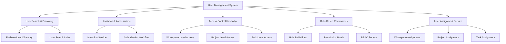
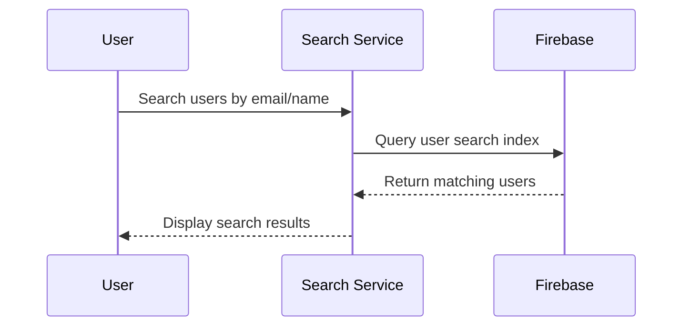
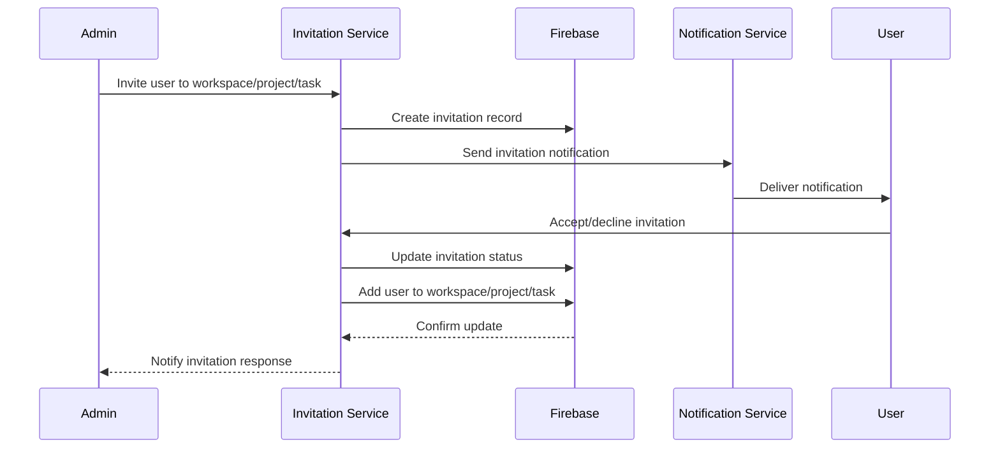
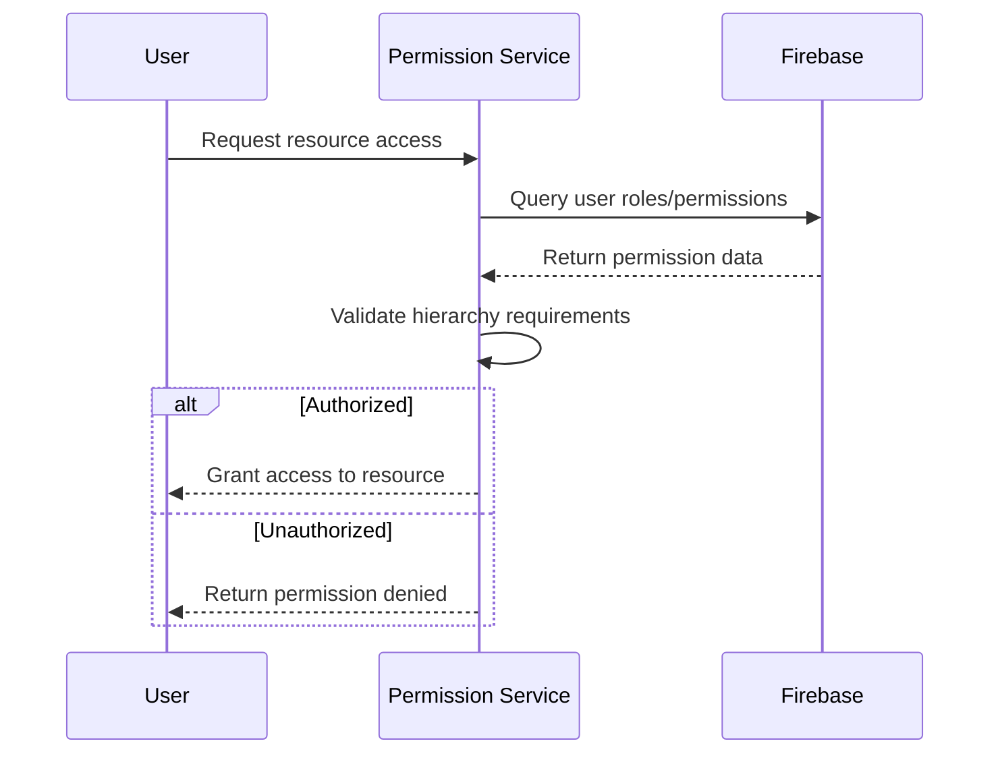
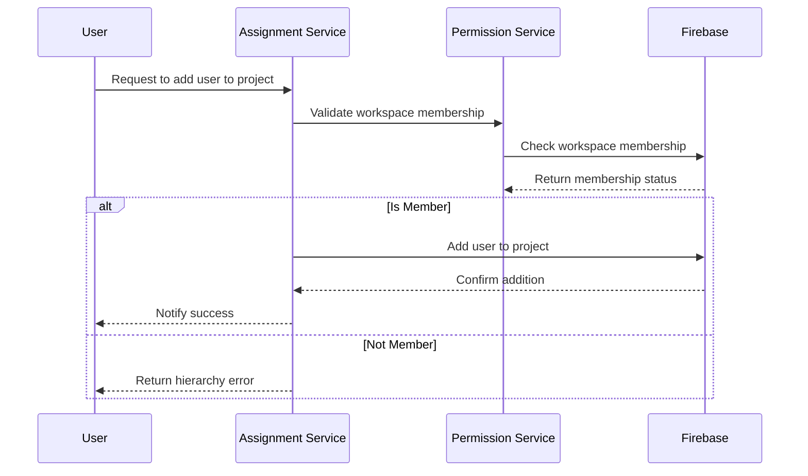
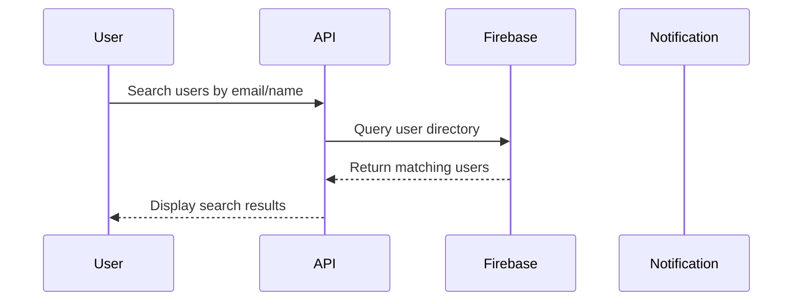
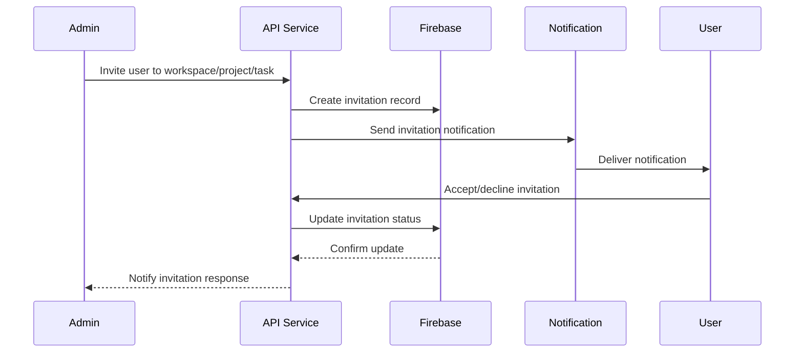
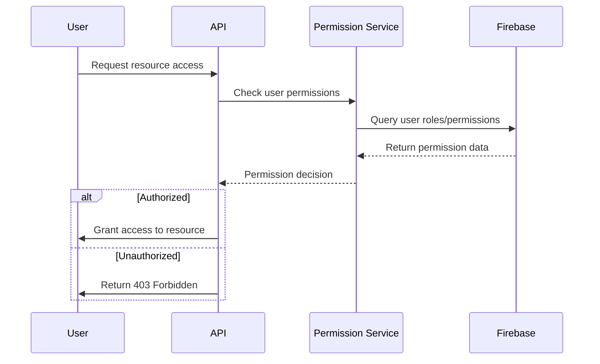

# User Management System Design for TaskFlow

## 1. Overview

This document outlines the design for implementing a comprehensive user management system in TaskFlow that enables multi-user collaboration with role-based access control. The system will allow users to search for other users in the Firebase database, add them to workspaces/projects/tasks, and manage permissions through a hierarchical role-based system.

### 1.1 Key Requirements

1. **User Discovery**: Users can search for other users in the Firebase database by email or name
2. **Hierarchical Access Control**: 
   - Users must be added to a workspace before being assigned to projects or tasks within that workspace
   - Users must be added to a project before being assigned to tasks within that project
   - Task-level access does not grant access to parent projects or workspaces
3. **Authorization Workflow**: 
   - Users must accept invitations before being added to workspaces/projects/tasks
   - Invitation acceptance is required for access provisioning
4. **Role-Based Permissions**: 
   - Each user has specific roles and permissions at each level (workspace, project, task)
   - Roles determine what actions a user can perform at each level
   - Roles determine what actions a user can perform at each level

## 2. Architecture

### 2.1 System Components



### 2.2 Access Control Hierarchy

The system implements a hierarchical access control model:
1. **Workspace Level**: Highest level of access, includes all projects and tasks within
2. **Project Level**: Intermediate level, includes all tasks within the project
3. **Task Level**: Lowest level, specific task access only

This hierarchy enforces the requirement that users must be added to a parent entity before being added to a child entity.

### 2.3 Data Model Extensions

#### 2.3.1 Enhanced User Model
```dart
class User {
  final String uid;
  final String email;
  final String? displayName;
  final String? photoURL;
  final DateTime createdAt;
  final DateTime lastActive;
}
```

#### 2.3.2 Enhanced Workspace Member Model
```dart
class WorkspaceMember {
  final String workspaceId;
  final String userId;
  final String role; // admin, member, viewer
  final String status; // invited, accepted, declined
  final DateTime joinedAt;
  final DateTime? invitedAt;
}
```

#### 2.3.3 Project Member Model
```dart
class ProjectMember {
  final String projectId;
  final String userId;
  final String role; // manager, member, viewer
  final String status; // invited, accepted, declined
  final DateTime joinedAt;
  final DateTime? invitedAt;
}
```

#### 2.3.4 Task Assignment Model
```dart
class TaskAssignment {
  final String taskId;
  final String userId;
  final String role; // assignee, collaborator, reviewer
  final String status; // invited, accepted, declined
  final DateTime assignedAt;
  final DateTime? invitedAt;
}
```

## 3. API Endpoints Reference

Since TaskFlow is a Flutter application using Firebase directly (rather than a REST API), these endpoints represent the Firebase collection structures and operations that will be implemented.

### 3.1 User Management Collections

| Collection | Path | Description |
|----------|--------|-------------|
| `users` | `/users/{userId}` | User profiles |
| `user_search_index` | `/user_search_index/{searchTerm}` | Search index for user discovery |

### 3.2 Workspace Management Collections

| Collection | Path | Description |
|----------|--------|-------------|
| `workspaces` | `/workspaces/{workspaceId}` | Workspace documents |
| `workspace_members` | `/workspaces/{workspaceId}/members/{userId}` | Workspace member records |
| `workspace_invitations` | `/workspaces/{workspaceId}/invitations/{invitationId}` | Workspace invitations |

### 3.3 Project Management Collections

| Collection | Path | Description |
|----------|--------|-------------|
| `projects` | `/workspaces/{workspaceId}/projects/{projectId}` | Project documents |
| `project_members` | `/workspaces/{workspaceId}/projects/{projectId}/members/{userId}` | Project member records |
| `project_invitations` | `/workspaces/{workspaceId}/projects/{projectId}/invitations/{invitationId}` | Project invitations |

### 3.4 Task Management Collections

| Collection | Path | Description |
|----------|--------|-------------|
| `tasks` | `/workspaces/{workspaceId}/projects/{projectId}/tasks/{taskId}` | Task documents |
| `task_assignments` | `/workspaces/{workspaceId}/projects/{projectId}/tasks/{taskId}/assignments/{assignmentId}` | Task assignment records |
| `task_invitations` | `/workspaces/{workspaceId}/projects/{projectId}/tasks/{taskId}/invitations/{invitationId}` | Task invitations |

## 4. Data Models & ORM Mapping

### 4.1 User Model
The User model remains largely unchanged from the existing implementation, as Firebase Authentication already handles user profiles.

### 4.2 Workspace Member Model
```dart
class WorkspaceMember {
  final String workspaceId;
  final String userId;
  final String role; // admin, member, viewer
  final String status; // invited, accepted, declined
  final DateTime joinedAt;
  final DateTime? invitedAt;
}
```

### 4.3 Project Member Model
```dart
class ProjectMember {
  final String projectId;
  final String userId;
  final String role; // manager, member, viewer
  final String status; // invited, accepted, declined
  final DateTime joinedAt;
  final DateTime? invitedAt;
}
```

### 4.4 Task Assignment Model
```dart
class TaskAssignment {
  final String taskId;
  final String userId;
  final String role; // assignee, collaborator, reviewer
  final String status; // invited, accepted, declined
  final DateTime assignedAt;
  final DateTime? invitedAt;
}
```

## 5. Business Logic Layer

### 5.1 User Search & Discovery Service
- Search users by email or display name in Firebase
- Return user profiles with minimal information for privacy
- Implement pagination for large result sets
- Create search index for efficient user discovery

### 5.2 Invitation Service
- Generate secure invitation records for workspace/project/task access
- Send invitation notifications via Firebase Cloud Messaging
- Handle invitation acceptance/decline workflows
- Manage invitation expiration (7 days)
- Validate invitation eligibility based on hierarchy

### 5.3 Access Control Service
- Validate user permissions for each action
- Implement hierarchical permission checking
- Cache permission results for performance
- Handle permission inheritance (workspace → project → task)
- Enforce access requirements (workspace membership for project access, etc.)

### 5.4 Assignment Service
- Manage user assignments to workspaces, projects, and tasks
- Handle role changes and permission updates
- Notify assigned users of new assignments
- Track assignment history
- Validate assignment hierarchy constraints

## 6. Middleware & Interceptors

### 6.1 Authentication Middleware
- Verify user authentication through Firebase Auth
- Extract user information from Firebase user object
- Handle authentication state changes

### 6.2 Authorization Middleware
- Check user permissions for requested actions
- Validate access to requested resources
- Return appropriate error responses for unauthorized access
- Enforce hierarchical access requirements

### 6.3 Invitation Validation
- Validate invitation eligibility based on hierarchy
- Check invitation expiration
- Verify user has not already been added

## 7. Role Definitions & Permission Matrix

### 7.1 Workspace Roles

| Role | Permissions |
|------|-------------|
| Admin | Create/delete projects, invite/remove members, manage workspace settings, assign roles |
| Member | Create projects, view all projects, participate in all projects |
| Viewer | View projects and tasks, no editing permissions |

### 7.2 Project Roles

| Role | Permissions |
|------|-------------|
| Manager | Create/delete tasks, invite/remove project members, manage project settings |
| Member | Create tasks, edit assigned tasks, participate in project discussions |
| Viewer | View tasks, no editing permissions |

### 7.3 Task Roles

| Role | Permissions |
|------|-------------|
| Assignee | Edit task details, update status, complete task |
| Collaborator | View and comment on task, update specific fields |
| Reviewer | Review task completion, approve/reject task |
| Viewer | View task details only |

## 8. Workflow Design

### 8.1 User Search Workflow


### 8.2 Invitation Workflow


### 8.3 Permission Validation Workflow


### 8.4 Hierarchy Enforcement Workflow


## 9. Security Considerations

### 9.1 Data Privacy
- Only expose minimal user information in search results (email, display name)
- Implement proper data encryption for sensitive information
- Follow privacy regulations for user data handling

### 9.2 Access Control
- Validate all permissions through Firebase Security Rules
- Implement rate limiting for user search to prevent abuse
- Log all access control decisions for audit purposes

### 9.3 Invitation Security
- Use secure, unguessable IDs for invitations
- Implement invitation expiration (7 days)
- Prevent duplicate invitations to the same user
- Validate invitation eligibility based on access hierarchy

## 10. Testing Strategy

### 10.1 Unit Tests
- Test user search functionality
- Test permission validation logic
- Test invitation generation and validation
- Test role-based access control
- Test hierarchy enforcement logic

### 10.2 Integration Tests
- Test end-to-end user invitation workflows
- Test permission inheritance across hierarchy
- Test access control for various user roles
- Test invitation acceptance/decline flows
- Test Firebase Security Rules

### 10.3 Security Tests
- Test unauthorized access attempts
- Test permission escalation attempts
- Test invitation eligibility validation
- Test data privacy compliance
- Test rate limiting for user search
| Collection | Path | Description |
|----------|--------|-------------|
| `workspaces` | `/workspaces/{workspaceId}` | Workspace documents |
| `workspace_members` | `/workspaces/{workspaceId}/members/{userId}` | Workspace member records |
| `workspace_invitations` | `/workspaces/{workspaceId}/invitations/{invitationId}` | Workspace invitations |

### 3.3 Project Management Collections

| Collection | Path | Description |
|----------|--------|-------------|
| `projects` | `/workspaces/{workspaceId}/projects/{projectId}` | Project documents |
| `project_members` | `/workspaces/{workspaceId}/projects/{projectId}/members/{userId}` | Project member records |
| `project_invitations` | `/workspaces/{workspaceId}/projects/{projectId}/invitations/{invitationId}` | Project invitations |

### 3.4 Task Management Collections

| Collection | Path | Description |
|----------|--------|-------------|
| `tasks` | `/workspaces/{workspaceId}/projects/{projectId}/tasks/{taskId}` | Task documents |
| `task_assignments` | `/workspaces/{workspaceId}/projects/{projectId}/tasks/{taskId}/assignments/{assignmentId}` | Task assignment records |
| `task_invitations` | `/workspaces/{workspaceId}/projects/{projectId}/tasks/{taskId}/invitations/{invitationId}` | Task invitations |

## 4. Data Models & ORM Mapping

### 4.1 User Model
The User model remains largely unchanged from the existing implementation, as Firebase Authentication already handles user profiles.

### 4.2 Workspace Member Model
```dart
class WorkspaceMember {
  final String workspaceId;
  final String userId;
  final String role; // admin, member, viewer
  final String status; // invited, accepted, declined
  final DateTime joinedAt;
  final DateTime? invitedAt;
}
```

### 4.3 Project Member Model
```dart
class ProjectMember {
  final String projectId;
  final String userId;
  final String role; // manager, member, viewer
  final String status; // invited, accepted, declined
  final DateTime joinedAt;
  final DateTime? invitedAt;
}
```

### 4.4 Task Assignment Model
```dart
class TaskAssignment {
  final String taskId;
  final String userId;
  final String role; // assignee, collaborator, reviewer
  final String status; // invited, accepted, declined
  final DateTime assignedAt;
  final DateTime? invitedAt;
}
```

## 5. Business Logic Layer

### 5.1 User Search & Discovery Service
- Search users by email or display name in Firebase
- Return user profiles with minimal information for privacy
- Implement pagination for large result sets
- Create search index for efficient user discovery

### 5.2 Invitation Service
- Generate secure invitation records for workspace/project/task access
- Send invitation notifications via Firebase Cloud Messaging
- Handle invitation acceptance/decline workflows
- Manage invitation expiration (7 days)
- Validate invitation eligibility based on hierarchy

### 5.3 Access Control Service
- Validate user permissions for each action
- Implement hierarchical permission checking
- Cache permission results for performance
- Handle permission inheritance (workspace → project → task)
- Enforce access requirements (workspace membership for project access, etc.)

### 5.4 Assignment Service
- Manage user assignments to workspaces, projects, and tasks
- Handle role changes and permission updates
- Notify assigned users of new assignments
- Track assignment history
- Validate assignment hierarchy constraints

## 6. Middleware & Interceptors

### 6.1 Authentication Middleware
- Verify user authentication through Firebase Auth
- Extract user information from Firebase user object
- Handle authentication state changes

### 6.2 Authorization Middleware
- Check user permissions for requested actions
- Validate access to requested resources
- Return appropriate error responses for unauthorized access
- Enforce hierarchical access requirements

### 6.3 Invitation Validation
- Validate invitation eligibility based on hierarchy
- Check invitation expiration
- Verify user has not already been added

## 7. Role Definitions & Permission Matrix

### 7.1 Workspace Roles

| Role | Permissions |
|------|-------------|
| Admin | Create/delete projects, invite/remove members, manage workspace settings, assign roles |
| Member | Create projects, view all projects, participate in all projects |
| Viewer | View projects and tasks, no editing permissions |

### 7.2 Project Roles

| Role | Permissions |
|------|-------------|
| Manager | Create/delete tasks, invite/remove project members, manage project settings |
| Member | Create tasks, edit assigned tasks, participate in project discussions |
| Viewer | View tasks, no editing permissions |

### 7.3 Task Roles

| Role | Permissions |
|------|-------------|
| Assignee | Edit task details, update status, complete task |
| Collaborator | View and comment on task, update specific fields |
| Reviewer | Review task completion, approve/reject task |
| Viewer | View task details only |

## 8. Workflow Design

### 8.1 User Search Workflow


### 8.2 Invitation Workflow


### 8.3 Permission Validation Workflow


### 8.4 Hierarchy Enforcement Workflow


## 9. Security Considerations

### 9.1 Data Privacy
- Only expose minimal user information in search results (email, display name)
- Implement proper data encryption for sensitive information
- Follow privacy regulations for user data handling

### 9.2 Access Control
- Validate all permissions through Firebase Security Rules
- Implement rate limiting for user search to prevent abuse
- Log all access control decisions for audit purposes

### 9.3 Invitation Security
- Use secure, unguessable IDs for invitations
- Implement invitation expiration (7 days)
- Prevent duplicate invitations to the same user
- Validate invitation eligibility based on access hierarchy

## 10. Testing Strategy

### 10.1 Unit Tests
- Test user search functionality
- Test permission validation logic
- Test invitation generation and validation
- Test role-based access control
- Test hierarchy enforcement logic

### 10.2 Integration Tests
- Test end-to-end user invitation workflows
- Test permission inheritance across hierarchy
- Test access control for various user roles
- Test invitation acceptance/decline flows
- Test Firebase Security Rules

### 10.3 Security Tests
- Test unauthorized access attempts
- Test permission escalation attempts
- Test invitation eligibility validation
- Test data privacy compliance
- Test rate limiting for user search
| Collection | Path | Description |
|----------|--------|-------------|
| `workspaces` | `/workspaces/{workspaceId}` | Workspace documents |
| `workspace_members` | `/workspaces/{workspaceId}/members/{userId}` | Workspace member records |
| `workspace_invitations` | `/workspaces/{workspaceId}/invitations/{invitationId}` | Workspace invitations |

### 3.3 Project Management Collections

| Collection | Path | Description |
|----------|--------|-------------|
| `projects` | `/workspaces/{workspaceId}/projects/{projectId}` | Project documents |
| `project_members` | `/workspaces/{workspaceId}/projects/{projectId}/members/{userId}` | Project member records |
| `project_invitations` | `/workspaces/{workspaceId}/projects/{projectId}/invitations/{invitationId}` | Project invitations |

### 3.4 Task Management Collections

| Collection | Path | Description |
|----------|--------|-------------|
| `tasks` | `/workspaces/{workspaceId}/projects/{projectId}/tasks/{taskId}` | Task documents |
| `task_assignments` | `/workspaces/{workspaceId}/projects/{projectId}/tasks/{taskId}/assignments/{assignmentId}` | Task assignment records |
| `task_invitations` | `/workspaces/{workspaceId}/projects/{projectId}/tasks/{taskId}/invitations/{invitationId}` | Task invitations |

## 4. Data Models & ORM Mapping

### 4.1 User Model
The User model remains largely unchanged from the existing implementation, as Firebase Authentication already handles user profiles.

### 4.2 Workspace Member Model
```dart
class WorkspaceMember {
  final String workspaceId;
  final String userId;
  final String role; // admin, member, viewer
  final String status; // invited, accepted, declined
  final DateTime joinedAt;
  final DateTime? invitedAt;
}
```

### 4.3 Project Member Model
```dart
class ProjectMember {
  final String projectId;
  final String userId;
  final String role; // manager, member, viewer
  final String status; // invited, accepted, declined
  final DateTime joinedAt;
  final DateTime? invitedAt;
}
```

### 4.4 Task Assignment Model
```dart
class TaskAssignment {
  final String taskId;
  final String userId;
  final String role; // assignee, collaborator, reviewer
  final String status; // invited, accepted, declined
  final DateTime assignedAt;
  final DateTime? invitedAt;
}
```

## 5. Business Logic Layer

### 5.1 User Search & Discovery Service
- Search users by email or display name in Firebase
- Return user profiles with minimal information for privacy
- Implement pagination for large result sets
- Create search index for efficient user discovery

### 5.2 Invitation Service
- Generate secure invitation records for workspace/project/task access
- Send invitation notifications via Firebase Cloud Messaging
- Handle invitation acceptance/decline workflows
- Manage invitation expiration (7 days)
- Validate invitation eligibility based on hierarchy

### 5.3 Access Control Service
- Validate user permissions for each action
- Implement hierarchical permission checking
- Cache permission results for performance
- Handle permission inheritance (workspace → project → task)
- Enforce access requirements (workspace membership for project access, etc.)

### 5.4 Assignment Service
- Manage user assignments to workspaces, projects, and tasks
- Handle role changes and permission updates
- Notify assigned users of new assignments
- Track assignment history
- Validate assignment hierarchy constraints

## 6. Middleware & Interceptors

### 6.1 Authentication Middleware
- Verify user authentication through Firebase Auth
- Extract user information from Firebase user object
- Handle authentication state changes

### 6.2 Authorization Middleware
- Check user permissions for requested actions
- Validate access to requested resources
- Return appropriate error responses for unauthorized access
- Enforce hierarchical access requirements

### 6.3 Invitation Validation
- Validate invitation eligibility based on hierarchy
- Check invitation expiration
- Verify user has not already been added

## 7. Role Definitions & Permission Matrix

### 7.1 Workspace Roles

| Role | Permissions |
|------|-------------|
| Admin | Create/delete projects, invite/remove members, manage workspace settings, assign roles |
| Member | Create projects, view all projects, participate in all projects |
| Viewer | View projects and tasks, no editing permissions |

### 7.2 Project Roles

| Role | Permissions |
|------|-------------|
| Manager | Create/delete tasks, invite/remove project members, manage project settings |
| Member | Create tasks, edit assigned tasks, participate in project discussions |
| Viewer | View tasks, no editing permissions |

### 7.3 Task Roles

| Role | Permissions |
|------|-------------|
| Assignee | Edit task details, update status, complete task |
| Collaborator | View and comment on task, update specific fields |
| Reviewer | Review task completion, approve/reject task |
| Viewer | View task details only |

## 8. Workflow Design

### 8.1 User Search Workflow


### 8.2 Invitation Workflow


### 8.3 Permission Validation Workflow


## 9. Security Considerations

### 9.1 Data Privacy
- Only expose minimal user information in search results (email, display name)
- Implement proper data encryption for sensitive information
- Follow privacy regulations for user data handling

### 9.2 Access Control
- Validate all permissions through Firebase Security Rules
- Implement rate limiting for user search to prevent abuse
- Log all access control decisions for audit purposes

### 9.3 Invitation Security
- Use secure, unguessable IDs for invitations
- Implement invitation expiration (7 days)
- Prevent duplicate invitations to the same user
- Validate invitation eligibility based on access hierarchy

## 10. Testing Strategy

### 10.1 Unit Tests
- Test user search functionality
- Test permission validation logic
- Test invitation generation and validation
- Test role-based access control
- Test hierarchy enforcement logic

### 10.2 Integration Tests
- Test end-to-end user invitation workflows
- Test permission inheritance across hierarchy
- Test access control for various user roles
- Test invitation acceptance/decline flows
- Test Firebase Security Rules

### 10.3 Security Tests
- Test unauthorized access attempts
- Test permission escalation attempts
- Test invitation eligibility validation
- Test data privacy compliance
- Test rate limiting for user search| Collection | Path | Description |
|----------|--------|-------------|
| `workspaces` | `/workspaces/{workspaceId}` | Workspace documents |
| `workspace_members` | `/workspaces/{workspaceId}/members/{userId}` | Workspace member records |
| `workspace_invitations` | `/workspaces/{workspaceId}/invitations/{invitationId}` | Workspace invitations |

### 3.3 Project Management Collections

| Collection | Path | Description |
|----------|--------|-------------|
| `projects` | `/workspaces/{workspaceId}/projects/{projectId}` | Project documents |
| `project_members` | `/workspaces/{workspaceId}/projects/{projectId}/members/{userId}` | Project member records |
| `project_invitations` | `/workspaces/{workspaceId}/projects/{projectId}/invitations/{invitationId}` | Project invitations |

### 3.4 Task Management Collections

| Collection | Path | Description |
|----------|--------|-------------|
| `tasks` | `/workspaces/{workspaceId}/projects/{projectId}/tasks/{taskId}` | Task documents |
| `task_assignments` | `/workspaces/{workspaceId}/projects/{projectId}/tasks/{taskId}/assignments/{assignmentId}` | Task assignment records |
| `task_invitations` | `/workspaces/{workspaceId}/projects/{projectId}/tasks/{taskId}/invitations/{invitationId}` | Task invitations |

## 4. Data Models & ORM Mapping

### 4.1 User Model
The User model remains largely unchanged from the existing implementation, as Firebase Authentication already handles user profiles.

### 4.2 Workspace Member Model
```dart
class WorkspaceMember {
  final String workspaceId;
  final String userId;
  final String role; // admin, member, viewer
  final String status; // invited, accepted, declined
  final DateTime joinedAt;
  final DateTime? invitedAt;
}
```

### 4.3 Project Member Model
```dart
class ProjectMember {
  final String projectId;
  final String userId;
  final String role; // manager, member, viewer
  final String status; // invited, accepted, declined
  final DateTime joinedAt;
  final DateTime? invitedAt;
}
```

### 4.4 Task Assignment Model
```dart
class TaskAssignment {
  final String taskId;
  final String userId;
  final String role; // assignee, collaborator, reviewer
  final String status; // invited, accepted, declined
  final DateTime assignedAt;
  final DateTime? invitedAt;
}
```

## 5. Business Logic Layer

### 5.1 User Search & Discovery Service
- Search users by email or display name in Firebase
- Return user profiles with minimal information for privacy
- Implement pagination for large result sets
- Create search index for efficient user discovery

### 5.2 Invitation Service
- Generate secure invitation records for workspace/project/task access
- Send invitation notifications via Firebase Cloud Messaging
- Handle invitation acceptance/decline workflows
- Manage invitation expiration (7 days)
- Validate invitation eligibility based on hierarchy

### 5.3 Access Control Service
- Validate user permissions for each action
- Implement hierarchical permission checking
- Cache permission results for performance
- Handle permission inheritance (workspace → project → task)
- Enforce access requirements (workspace membership for project access, etc.)

### 5.4 Assignment Service
- Manage user assignments to workspaces, projects, and tasks
- Handle role changes and permission updates
- Notify assigned users of new assignments
- Track assignment history
- Validate assignment hierarchy constraints

## 6. Middleware & Interceptors

### 6.1 Authentication Middleware
- Verify user authentication through Firebase Auth
- Extract user information from Firebase user object
- Handle authentication state changes

### 6.2 Authorization Middleware
- Check user permissions for requested actions
- Validate access to requested resources
- Return appropriate error responses for unauthorized access
- Enforce hierarchical access requirements

### 6.3 Invitation Validation
- Validate invitation eligibility based on hierarchy
- Check invitation expiration
- Verify user has not already been added

## 7. Role Definitions & Permission Matrix

### 7.1 Workspace Roles

| Role | Permissions |
|------|-------------|
| Admin | Create/delete projects, invite/remove members, manage workspace settings, assign roles |
| Member | Create projects, view all projects, participate in all projects |
| Viewer | View projects and tasks, no editing permissions |

### 7.2 Project Roles

| Role | Permissions |
|------|-------------|
| Manager | Create/delete tasks, invite/remove project members, manage project settings |
| Member | Create tasks, edit assigned tasks, participate in project discussions |
| Viewer | View tasks, no editing permissions |

### 7.3 Task Roles

| Role | Permissions |
|------|-------------|
| Assignee | Edit task details, update status, complete task |
| Collaborator | View and comment on task, update specific fields |
| Reviewer | Review task completion, approve/reject task |
| Viewer | View task details only |

## 8. Workflow Design

### 8.1 User Search Workflow


### 8.2 Invitation Workflow


### 8.3 Permission Validation Workflow


## 9. Security Considerations

### 9.1 Data Privacy
- Only expose minimal user information in search results (email, display name)
- Implement proper data encryption for sensitive information
- Follow privacy regulations for user data handling

### 9.2 Access Control
- Validate all permissions through Firebase Security Rules
- Implement rate limiting for user search to prevent abuse
- Log all access control decisions for audit purposes

### 9.3 Invitation Security
- Use secure, unguessable IDs for invitations
- Implement invitation expiration (7 days)
- Prevent duplicate invitations to the same user
- Validate invitation eligibility based on access hierarchy

## 10. Testing Strategy

### 10.1 Unit Tests
- Test user search functionality
- Test permission validation logic
- Test invitation generation and validation
- Test role-based access control
- Test hierarchy enforcement logic

### 10.2 Integration Tests
- Test end-to-end user invitation workflows
- Test permission inheritance across hierarchy
- Test access control for various user roles
- Test invitation acceptance/decline flows
- Test Firebase Security Rules

### 10.3 Security Tests
- Test unauthorized access attempts
- Test permission escalation attempts
- Test invitation eligibility validation
- Test data privacy compliance
- Test rate limiting for user search| Collection | Path | Description |
|----------|--------|-------------|
| `workspaces` | `/workspaces/{workspaceId}` | Workspace documents |
| `workspace_members` | `/workspaces/{workspaceId}/members/{userId}` | Workspace member records |
| `workspace_invitations` | `/workspaces/{workspaceId}/invitations/{invitationId}` | Workspace invitations |

### 3.3 Project Management Collections

| Collection | Path | Description |
|----------|--------|-------------|
| `projects` | `/workspaces/{workspaceId}/projects/{projectId}` | Project documents |
| `project_members` | `/workspaces/{workspaceId}/projects/{projectId}/members/{userId}` | Project member records |
| `project_invitations` | `/workspaces/{workspaceId}/projects/{projectId}/invitations/{invitationId}` | Project invitations |

### 3.4 Task Management Collections

| Collection | Path | Description |
|----------|--------|-------------|
| `tasks` | `/workspaces/{workspaceId}/projects/{projectId}/tasks/{taskId}` | Task documents |
| `task_assignments` | `/workspaces/{workspaceId}/projects/{projectId}/tasks/{taskId}/assignments/{assignmentId}` | Task assignment records |
| `task_invitations` | `/workspaces/{workspaceId}/projects/{projectId}/tasks/{taskId}/invitations/{invitationId}` | Task invitations |

## 4. Data Models & ORM Mapping

### 4.1 User Model
The User model remains largely unchanged from the existing implementation, as Firebase Authentication already handles user profiles.

### 4.2 Workspace Member Model
```dart
class WorkspaceMember {
  final String workspaceId;
  final String userId;
  final String role; // admin, member, viewer
  final String status; // invited, accepted, declined
  final DateTime joinedAt;
  final DateTime? invitedAt;
}
```

### 4.3 Project Member Model
```dart
class ProjectMember {
  final String projectId;
  final String userId;
  final String role; // manager, member, viewer
  final String status; // invited, accepted, declined
  final DateTime joinedAt;
  final DateTime? invitedAt;
}
```

### 4.4 Task Assignment Model
```dart
class TaskAssignment {
  final String taskId;
  final String userId;
  final String role; // assignee, collaborator, reviewer
  final String status; // invited, accepted, declined
  final DateTime assignedAt;
  final DateTime? invitedAt;
}
```

## 5. Business Logic Layer

### 5.1 User Search & Discovery Service
- Search users by email or display name in Firebase
- Return user profiles with minimal information for privacy
- Implement pagination for large result sets
- Create search index for efficient user discovery

### 5.2 Invitation Service
- Generate secure invitation records for workspace/project/task access
- Send invitation notifications via Firebase Cloud Messaging
- Handle invitation acceptance/decline workflows
- Manage invitation expiration (7 days)
- Validate invitation eligibility based on hierarchy

### 5.3 Access Control Service
- Validate user permissions for each action
- Implement hierarchical permission checking
- Cache permission results for performance
- Handle permission inheritance (workspace → project → task)
- Enforce access requirements (workspace membership for project access, etc.)

### 5.4 Assignment Service
- Manage user assignments to workspaces, projects, and tasks
- Handle role changes and permission updates
- Notify assigned users of new assignments
- Track assignment history
- Validate assignment hierarchy constraints

## 6. Middleware & Interceptors

### 6.1 Authentication Middleware
- Verify user authentication through Firebase Auth
- Extract user information from Firebase user object
- Handle authentication state changes

### 6.2 Authorization Middleware
- Check user permissions for requested actions
- Validate access to requested resources
- Return appropriate error responses for unauthorized access
- Enforce hierarchical access requirements

### 6.3 Invitation Validation
- Validate invitation eligibility based on hierarchy
- Check invitation expiration
- Verify user has not already been added

## 7. Role Definitions & Permission Matrix

### 7.1 Workspace Roles

| Role | Permissions |
|------|-------------|
| Admin | Create/delete projects, invite/remove members, manage workspace settings, assign roles |
| Member | Create projects, view all projects, participate in all projects |
| Viewer | View projects and tasks, no editing permissions |

### 7.2 Project Roles

| Role | Permissions |
|------|-------------|
| Manager | Create/delete tasks, invite/remove project members, manage project settings |
| Member | Create tasks, edit assigned tasks, participate in project discussions |
| Viewer | View tasks, no editing permissions |

### 7.3 Task Roles

| Role | Permissions |
|------|-------------|
| Assignee | Edit task details, update status, complete task |
| Collaborator | View and comment on task, update specific fields |
| Reviewer | Review task completion, approve/reject task |
| Viewer | View task details only |

## 8. Workflow Design

### 8.1 User Search Workflow


### 8.2 Invitation Workflow


### 8.3 Permission Validation Workflow


## 9. Security Considerations

### 9.1 Data Privacy
- Only expose minimal user information in search results (email, display name)
- Implement proper data encryption for sensitive information
- Follow privacy regulations for user data handling

### 9.2 Access Control
- Validate all permissions through Firebase Security Rules
- Implement rate limiting for user search to prevent abuse
- Log all access control decisions for audit purposes

### 9.3 Invitation Security
- Use secure, unguessable IDs for invitations
- Implement invitation expiration (7 days)
- Prevent duplicate invitations to the same user
- Validate invitation eligibility based on access hierarchy

## 10. Testing Strategy

### 10.1 Unit Tests
- Test user search functionality
- Test permission validation logic
- Test invitation generation and validation
- Test role-based access control

### 10.2 Integration Tests
- Test end-to-end user invitation workflows
- Test permission inheritance across hierarchy
- Test access control for various user roles
- Test invitation acceptance/decline flows

### 10.3 Security Tests
- Test unauthorized access attempts
- Test permission escalation attempts
- Test invitation token security
- Test data privacy compliance### 3.2 Workspace Management Collections

| Collection | Path | Description |
|----------|--------|-------------|
| `workspaces` | `/workspaces/{workspaceId}` | Workspace documents |
| `workspace_members` | `/workspaces/{workspaceId}/members/{userId}` | Workspace member records |
| `workspace_invitations` | `/workspaces/{workspaceId}/invitations/{invitationId}` | Workspace invitations |

### 3.3 Project Management Collections

| Collection | Path | Description |
|----------|--------|-------------|
| `projects` | `/workspaces/{workspaceId}/projects/{projectId}` | Project documents |
| `project_members` | `/workspaces/{workspaceId}/projects/{projectId}/members/{userId}` | Project member records |
| `project_invitations` | `/workspaces/{workspaceId}/projects/{projectId}/invitations/{invitationId}` | Project invitations |

### 3.4 Task Management Collections

| Collection | Path | Description |
|----------|--------|-------------|
| `tasks` | `/workspaces/{workspaceId}/projects/{projectId}/tasks/{taskId}` | Task documents |
| `task_assignments` | `/workspaces/{workspaceId}/projects/{projectId}/tasks/{taskId}/assignments/{assignmentId}` | Task assignment records |
| `task_invitations` | `/workspaces/{workspaceId}/projects/{projectId}/tasks/{taskId}/invitations/{invitationId}` | Task invitations |

## 4. Data Models & ORM Mapping

### 4.1 User Model
The User model remains largely unchanged from the existing implementation, as Firebase Authentication already handles user profiles.

### 4.2 Workspace Member Model
```dart
class WorkspaceMember {
  final String workspaceId;
  final String userId;
  final String role; // admin, member, viewer
  final String status; // invited, accepted, declined
  final DateTime joinedAt;
  final DateTime? invitedAt;
}
```

### 4.3 Project Member Model
```dart
class ProjectMember {
  final String projectId;
  final String userId;
  final String role; // manager, member, viewer
  final String status; // invited, accepted, declined
  final DateTime joinedAt;
  final DateTime? invitedAt;
}
```

### 4.4 Task Assignment Model
```dart
class TaskAssignment {
  final String taskId;
  final String userId;
  final String role; // assignee, collaborator, reviewer
  final String status; // invited, accepted, declined
  final DateTime assignedAt;
  final DateTime? invitedAt;
}
```

## 5. Business Logic Layer

### 5.1 User Search & Discovery Service
- Search users by email or display name in Firebase
- Return user profiles with minimal information for privacy
- Implement pagination for large result sets
- Create search index for efficient user discovery

### 5.2 Invitation Service
- Generate secure invitation records for workspace/project/task access
- Send invitation notifications via Firebase Cloud Messaging
- Handle invitation acceptance/decline workflows
- Manage invitation expiration (7 days)
- Validate invitation eligibility based on hierarchy

### 5.3 Access Control Service
- Validate user permissions for each action
- Implement hierarchical permission checking
- Cache permission results for performance
- Handle permission inheritance (workspace → project → task)
- Enforce access requirements (workspace membership for project access, etc.)

### 5.4 Assignment Service
- Manage user assignments to workspaces, projects, and tasks
- Handle role changes and permission updates
- Notify assigned users of new assignments
- Track assignment history
- Validate assignment hierarchy constraints

## 6. Middleware & Interceptors

### 6.1 Authentication Middleware
- Verify user authentication through Firebase Auth
- Extract user information from Firebase user object
- Handle authentication state changes

### 6.2 Authorization Middleware
- Check user permissions for requested actions
- Validate access to requested resources
- Return appropriate error responses for unauthorized access
- Enforce hierarchical access requirements

### 6.3 Invitation Validation
- Validate invitation eligibility based on hierarchy
- Check invitation expiration
- Verify user has not already been added

## 7. Role Definitions & Permission Matrix

### 7.1 Workspace Roles

| Role | Permissions |
|------|-------------|
| Admin | Create/delete projects, invite/remove members, manage workspace settings, assign roles |
| Member | Create projects, view all projects, participate in all projects |
| Viewer | View projects and tasks, no editing permissions |

### 7.2 Project Roles

| Role | Permissions |
|------|-------------|
| Manager | Create/delete tasks, invite/remove project members, manage project settings |
| Member | Create tasks, edit assigned tasks, participate in project discussions |
| Viewer | View tasks, no editing permissions |

### 7.3 Task Roles

| Role | Permissions |
|------|-------------|
| Assignee | Edit task details, update status, complete task |
| Collaborator | View and comment on task, update specific fields |
| Reviewer | Review task completion, approve/reject task |
| Viewer | View task details only |

## 8. Workflow Design

### 8.1 User Search Workflow


### 8.2 Invitation Workflow


### 8.3 Permission Validation Workflow
```mermaid
sequenceDiagram
    participant U as User
    participant A as API
    participant P as Permission Service
    participant F as Firebase
    
    U->>A: Request resource access
    A->>P: Check user permissions
    P->>F: Query user roles/permissions
    F-->>P: Return permission data
    P-->>A: Permission decision
    alt Authorized
        A->>U: Grant access to resource
    else Unauthorized
        A->>U: Return 403 Forbidden
    end
```

## 9. Security Considerations

### 9.1 Data Privacy
- Only expose minimal user information in search results
- Implement proper data encryption for sensitive information
- Follow GDPR/privacy regulations for user data handling

### 9.2 Access Control
- Validate all permissions server-side
- Implement rate limiting for user search to prevent abuse
- Log all access control decisions for audit purposes

### 9.3 Invitation Security
- Use secure tokens for invitations
- Implement invitation expiration (e.g., 7 days)
- Prevent invitation replay attacks

## 10. Testing Strategy

### 10.1 Unit Tests
- Test user search functionality
- Test permission validation logic
- Test invitation generation and validation
- Test role-based access control

### 10.2 Integration Tests
- Test end-to-end user invitation workflows
- Test permission inheritance across hierarchy
- Test access control for various user roles
- Test invitation acceptance/decline flows

### 10.3 Security Tests
- Test unauthorized access attempts
- Test permission escalation attempts
- Test invitation token security
- Test data privacy compliance### 3.2 Workspace Management Collections

| Collection | Path | Description |
|----------|--------|-------------|
| `workspaces` | `/workspaces/{workspaceId}` | Workspace documents |
| `workspace_members` | `/workspaces/{workspaceId}/members/{userId}` | Workspace member records |
| `workspace_invitations` | `/workspaces/{workspaceId}/invitations/{invitationId}` | Workspace invitations |

### 3.3 Project Management Collections

| Collection | Path | Description |
|----------|--------|-------------|
| `projects` | `/workspaces/{workspaceId}/projects/{projectId}` | Project documents |
| `project_members` | `/workspaces/{workspaceId}/projects/{projectId}/members/{userId}` | Project member records |
| `project_invitations` | `/workspaces/{workspaceId}/projects/{projectId}/invitations/{invitationId}` | Project invitations |

### 3.4 Task Management Collections

| Collection | Path | Description |
|----------|--------|-------------|
| `tasks` | `/workspaces/{workspaceId}/projects/{projectId}/tasks/{taskId}` | Task documents |
| `task_assignments` | `/workspaces/{workspaceId}/projects/{projectId}/tasks/{taskId}/assignments/{assignmentId}` | Task assignment records |
| `task_invitations` | `/workspaces/{workspaceId}/projects/{projectId}/tasks/{taskId}/invitations/{invitationId}` | Task invitations |

## 4. Data Models & ORM Mapping

### 4.1 User Model
The User model remains largely unchanged from the existing implementation, as Firebase Authentication already handles user profiles.

### 4.2 Workspace Member Model
```dart
class WorkspaceMember {
  final String workspaceId;
  final String userId;
  final String role; // admin, member, viewer
  final String status; // invited, accepted, declined
  final DateTime joinedAt;
  final DateTime? invitedAt;
}
```

### 4.3 Project Member Model
```dart
class ProjectMember {
  final String projectId;
  final String userId;
  final String role; // manager, member, viewer
  final String status; // invited, accepted, declined
  final DateTime joinedAt;
  final DateTime? invitedAt;
}
```

### 4.4 Task Assignment Model
```dart
class TaskAssignment {
  final String taskId;
  final String userId;
  final String role; // assignee, collaborator, reviewer
  final String status; // invited, accepted, declined
  final DateTime assignedAt;
  final DateTime? invitedAt;
}
```

## 5. Business Logic Layer

### 5.1 User Search & Discovery Service
- Search users by email or display name in Firebase
- Return user profiles with minimal information for privacy
- Implement pagination for large result sets
- Create search index for efficient user discovery

### 5.2 Invitation Service
- Generate secure invitation records for workspace/project/task access
- Send invitation notifications via Firebase Cloud Messaging
- Handle invitation acceptance/decline workflows
- Manage invitation expiration (7 days)
- Validate invitation eligibility based on hierarchy

### 5.3 Access Control Service
- Validate user permissions for each action
- Implement hierarchical permission checking
- Cache permission results for performance
- Handle permission inheritance (workspace → project → task)
- Enforce access requirements (workspace membership for project access, etc.)

### 5.4 Assignment Service
- Manage user assignments to workspaces, projects, and tasks
- Handle role changes and permission updates
- Notify assigned users of new assignments
- Track assignment history
- Validate assignment hierarchy constraints

## 6. Middleware & Interceptors

### 6.1 Authentication Middleware
- Verify user authentication through Firebase Auth
- Extract user information from Firebase user object
- Handle authentication state changes

### 6.2 Authorization Middleware
- Check user permissions for requested actions
- Validate access to requested resources
- Return appropriate error responses for unauthorized access
- Enforce hierarchical access requirements

### 6.3 Invitation Validation
- Validate invitation eligibility based on hierarchy
- Check invitation expiration
- Verify user has not already been added

## 7. Role Definitions & Permission Matrix

### 7.1 Workspace Roles

| Role | Permissions |
|------|-------------|
| Admin | Create/delete projects, add/remove members, manage workspace settings, assign roles |
| Member | Create projects, view all projects, participate in all projects |
| Viewer | View projects and tasks, no editing permissions |

### 7.2 Project Roles

| Role | Permissions |
|------|-------------|
| Manager | Create/delete tasks, add/remove project members, manage project settings |
| Member | Create tasks, edit assigned tasks, participate in project discussions |
| Viewer | View tasks, no editing permissions |

### 7.3 Task Roles

| Role | Permissions |
|------|-------------|
| Assignee | Edit task details, update status, complete task |
| Collaborator | View and comment on task, update specific fields |
| Reviewer | Review task completion, approve/reject task |
| Viewer | View task details only |

## 8. Workflow Design

### 8.1 User Search Workflow
```mermaid
sequenceDiagram
    participant U as User
    participant A as API
    participant F as Firebase
    participant N as Notification
    
    U->>A: Search users by email/name
    A->>F: Query user directory
    F-->>A: Return matching users
    A-->>U: Display search results
```

### 8.2 Invitation Workflow
```mermaid
sequenceDiagram
    participant A as Admin
    participant API as API Service
    participant F as Firebase
    participant N as Notification
    participant U as User
    
    A->>API: Invite user to workspace/project/task
    API->>F: Create invitation record
    API->>N: Send invitation notification
    N->>U: Deliver notification
    U->>API: Accept/decline invitation
    API->>F: Update invitation status
    F-->>API: Confirm update
    API-->>A: Notify invitation response
```

### 8.3 Permission Validation Workflow
```mermaid
sequenceDiagram
    participant U as User
    participant A as API
    participant P as Permission Service
    participant F as Firebase
    
    U->>A: Request resource access
    A->>P: Check user permissions
    P->>F: Query user roles/permissions
    F-->>P: Return permission data
    P-->>A: Permission decision
    alt Authorized
        A->>U: Grant access to resource
    else Unauthorized
        A->>U: Return 403 Forbidden
    end
```

## 9. Security Considerations

### 9.1 Data Privacy
- Only expose minimal user information in search results
- Implement proper data encryption for sensitive information
- Follow GDPR/privacy regulations for user data handling

### 9.2 Access Control
- Validate all permissions server-side
- Implement rate limiting for user search to prevent abuse
- Log all access control decisions for audit purposes

### 9.3 Invitation Security
- Use secure tokens for invitations
- Implement invitation expiration (e.g., 7 days)
- Prevent invitation replay attacks

## 10. Testing Strategy

### 10.1 Unit Tests
- Test user search functionality
- Test permission validation logic
- Test invitation generation and validation
- Test role-based access control

### 10.2 Integration Tests
- Test end-to-end user invitation workflows
- Test permission inheritance across hierarchy
- Test access control for various user roles
- Test invitation acceptance/decline flows

### 10.3 Security Tests
- Test unauthorized access attempts
- Test permission escalation attempts
- Test invitation token security
- Test data privacy compliance### 3.2 Workspace Management Collections

| Collection | Path | Description |
|----------|--------|-------------|
| `workspaces` | `/workspaces/{workspaceId}` | Workspace documents |
| `workspace_members` | `/workspaces/{workspaceId}/members/{userId}` | Workspace member records |
| `workspace_invitations` | `/workspaces/{workspaceId}/invitations/{invitationId}` | Workspace invitations |

### 3.3 Project Management Collections

| Collection | Path | Description |
|----------|--------|-------------|
| `projects` | `/workspaces/{workspaceId}/projects/{projectId}` | Project documents |
| `project_members` | `/workspaces/{workspaceId}/projects/{projectId}/members/{userId}` | Project member records |
| `project_invitations` | `/workspaces/{workspaceId}/projects/{projectId}/invitations/{invitationId}` | Project invitations |

### 3.4 Task Management Collections

| Collection | Path | Description |
|----------|--------|-------------|
| `tasks` | `/workspaces/{workspaceId}/projects/{projectId}/tasks/{taskId}` | Task documents |
| `task_assignments` | `/workspaces/{workspaceId}/projects/{projectId}/tasks/{taskId}/assignments/{assignmentId}` | Task assignment records |
| `task_invitations` | `/workspaces/{workspaceId}/projects/{projectId}/tasks/{taskId}/invitations/{invitationId}` | Task invitations |

## 4. Data Models & ORM Mapping

### 4.1 User Model
The User model remains largely unchanged from the existing implementation, as Firebase Authentication already handles user profiles.

### 4.2 Workspace Member Model
```dart
class WorkspaceMember {
  final String workspaceId;
  final String userId;
  final String role; // admin, member, viewer
  final String status; // invited, accepted, declined
  final DateTime joinedAt;
  final DateTime? invitedAt;
}
```

### 4.3 Project Member Model
```dart
class ProjectMember {
  final String projectId;
  final String userId;
  final String role; // manager, member, viewer
  final String status; // invited, accepted, declined
  final DateTime joinedAt;
  final DateTime? invitedAt;
}
```

### 4.4 Task Assignment Model
```dart
class TaskAssignment {
  final String taskId;
  final String userId;
  final String role; // assignee, collaborator, reviewer
  final String status; // invited, accepted, declined
  final DateTime assignedAt;
  final DateTime? invitedAt;
}
```

## 5. Business Logic Layer

### 5.1 User Search & Discovery Service
- Search users by email or display name in Firebase
- Return user profiles with minimal information for privacy
- Implement pagination for large result sets
- Create search index for efficient user discovery

### 5.2 Invitation Service
- Generate secure invitation records for workspace/project/task access
- Send invitation notifications via Firebase Cloud Messaging
- Handle invitation acceptance/decline workflows
- Manage invitation expiration (7 days)
- Validate invitation eligibility based on hierarchy

### 5.3 Access Control Service
- Validate user permissions for each action
- Implement hierarchical permission checking
- Cache permission results for performance
- Handle permission inheritance (workspace → project → task)
- Enforce access requirements (workspace membership for project access, etc.)

### 5.4 Assignment Service
- Manage user assignments to workspaces, projects, and tasks
- Handle role changes and permission updates
- Notify assigned users of new assignments
- Track assignment history
- Validate assignment hierarchy constraints

## 6. Middleware & Interceptors

### 6.1 Authentication Middleware
- Verify user authentication tokens
- Extract user information from requests
- Handle authentication failures

### 6.2 Authorization Middleware
- Check user permissions for requested actions
- Validate access to requested resources
- Return appropriate error responses for unauthorized access

### 6.3 Invitation Validation Middleware
- Validate invitation tokens
- Check invitation expiration
- Verify user eligibility for invitations

## 7. Role Definitions & Permission Matrix

### 7.1 Workspace Roles

| Role | Permissions |
|------|-------------|
| Admin | Create/delete projects, add/remove members, manage workspace settings, assign roles |
| Member | Create projects, view all projects, participate in all projects |
| Viewer | View projects and tasks, no editing permissions |

### 7.2 Project Roles

| Role | Permissions |
|------|-------------|
| Manager | Create/delete tasks, add/remove project members, manage project settings |
| Member | Create tasks, edit assigned tasks, participate in project discussions |
| Viewer | View tasks, no editing permissions |

### 7.3 Task Roles

| Role | Permissions |
|------|-------------|
| Assignee | Edit task details, update status, complete task |
| Collaborator | View and comment on task, update specific fields |
| Reviewer | Review task completion, approve/reject task |
| Viewer | View task details only |

## 8. Workflow Design

### 8.1 User Search Workflow
```mermaid
sequenceDiagram
    participant U as User
    participant A as API
    participant F as Firebase
    participant N as Notification
    
    U->>A: Search users by email/name
    A->>F: Query user directory
    F-->>A: Return matching users
    A-->>U: Display search results
```

### 8.2 Invitation Workflow
```mermaid
sequenceDiagram
    participant A as Admin
    participant API as API Service
    participant F as Firebase
    participant N as Notification
    participant U as User
    
    A->>API: Invite user to workspace/project/task
    API->>F: Create invitation record
    API->>N: Send invitation notification
    N->>U: Deliver notification
    U->>API: Accept/decline invitation
    API->>F: Update invitation status
    F-->>API: Confirm update
    API-->>A: Notify invitation response
```

### 8.3 Permission Validation Workflow
```mermaid
sequenceDiagram
    participant U as User
    participant A as API
    participant P as Permission Service
    participant F as Firebase
    
    U->>A: Request resource access
    A->>P: Check user permissions
    P->>F: Query user roles/permissions
    F-->>P: Return permission data
    P-->>A: Permission decision
    alt Authorized
        A->>U: Grant access to resource
    else Unauthorized
        A->>U: Return 403 Forbidden
    end
```

## 9. Security Considerations

### 9.1 Data Privacy
- Only expose minimal user information in search results
- Implement proper data encryption for sensitive information
- Follow GDPR/privacy regulations for user data handling

### 9.2 Access Control
- Validate all permissions server-side
- Implement rate limiting for user search to prevent abuse
- Log all access control decisions for audit purposes

### 9.3 Invitation Security
- Use secure tokens for invitations
- Implement invitation expiration (e.g., 7 days)
- Prevent invitation replay attacks

## 10. Testing Strategy

### 10.1 Unit Tests
- Test user search functionality
- Test permission validation logic
- Test invitation generation and validation
- Test role-based access control

### 10.2 Integration Tests
- Test end-to-end user invitation workflows
- Test permission inheritance across hierarchy
- Test access control for various user roles
- Test invitation acceptance/decline flows

### 10.3 Security Tests
- Test unauthorized access attempts
- Test permission escalation attempts
- Test invitation token security
- Test data privacy compliance### 3.2 Workspace Management Collections

| Collection | Path | Description |
|----------|--------|-------------|
| `workspaces` | `/workspaces/{workspaceId}` | Workspace documents |
| `workspace_members` | `/workspaces/{workspaceId}/members/{userId}` | Workspace member records |
| `workspace_invitations` | `/workspaces/{workspaceId}/invitations/{invitationId}` | Workspace invitations |

### 3.3 Project Management Collections

| Collection | Path | Description |
|----------|--------|-------------|
| `projects` | `/workspaces/{workspaceId}/projects/{projectId}` | Project documents |
| `project_members` | `/workspaces/{workspaceId}/projects/{projectId}/members/{userId}` | Project member records |
| `project_invitations` | `/workspaces/{workspaceId}/projects/{projectId}/invitations/{invitationId}` | Project invitations |

### 3.4 Task Management Collections

| Collection | Path | Description |
|----------|--------|-------------|
| `tasks` | `/workspaces/{workspaceId}/projects/{projectId}/tasks/{taskId}` | Task documents |
| `task_assignments` | `/workspaces/{workspaceId}/projects/{projectId}/tasks/{taskId}/assignments/{assignmentId}` | Task assignment records |
| `task_invitations` | `/workspaces/{workspaceId}/projects/{projectId}/tasks/{taskId}/invitations/{invitationId}` | Task invitations |

## 4. Data Models & ORM Mapping

### 4.1 User Model
The User model remains largely unchanged from the existing implementation, as Firebase Authentication already handles user profiles.

### 4.2 Workspace Member Model
```dart
class WorkspaceMember {
  final String workspaceId;
  final String userId;
  final String role; // admin, member, viewer
  final String status; // invited, accepted, declined
  final DateTime joinedAt;
  final DateTime? invitedAt;
}
```

### 4.3 Project Member Model
```dart
class ProjectMember {
  final String projectId;
  final String userId;
  final String role; // manager, member, viewer
  final String status; // invited, accepted, declined
  final DateTime joinedAt;
  final DateTime? invitedAt;
}
```

### 4.4 Task Assignment Model
```dart
class TaskAssignment {
  final String taskId;
  final String userId;
  final String role; // assignee, collaborator, reviewer
  final String status; // invited, accepted, declined
  final DateTime assignedAt;
  final DateTime? invitedAt;
}
```

## 5. Business Logic Layer

### 5.1 User Search & Discovery Service
- Search users by email or display name in Firebase
- Return user profiles with minimal information for privacy
- Implement pagination for large result sets

### 5.2 Invitation Service
- Generate invitation tokens for workspace/project/task access
- Send invitation notifications via email/push notification
- Handle invitation acceptance/decline workflows
- Manage invitation expiration

### 5.3 Access Control Service
- Validate user permissions for each action
- Implement hierarchical permission checking
- Cache permission results for performance
- Handle permission inheritance (workspace → project → task)

### 5.4 Assignment Service
- Manage user assignments to workspaces, projects, and tasks
- Handle role changes and permission updates
- Notify assigned users of new assignments
- Track assignment history

## 6. Middleware & Interceptors

### 6.1 Authentication Middleware
- Verify user authentication tokens
- Extract user information from requests
- Handle authentication failures

### 6.2 Authorization Middleware
- Check user permissions for requested actions
- Validate access to requested resources
- Return appropriate error responses for unauthorized access

### 6.3 Invitation Validation Middleware
- Validate invitation tokens
- Check invitation expiration
- Verify user eligibility for invitations

## 7. Role Definitions & Permission Matrix

### 7.1 Workspace Roles

| Role | Permissions |
|------|-------------|
| Admin | Create/delete projects, add/remove members, manage workspace settings, assign roles |
| Member | Create projects, view all projects, participate in all projects |
| Viewer | View projects and tasks, no editing permissions |

### 7.2 Project Roles

| Role | Permissions |
|------|-------------|
| Manager | Create/delete tasks, add/remove project members, manage project settings |
| Member | Create tasks, edit assigned tasks, participate in project discussions |
| Viewer | View tasks, no editing permissions |

### 7.3 Task Roles

| Role | Permissions |
|------|-------------|
| Assignee | Edit task details, update status, complete task |
| Collaborator | View and comment on task, update specific fields |
| Reviewer | Review task completion, approve/reject task |
| Viewer | View task details only |

## 8. Workflow Design

### 8.1 User Search Workflow
```mermaid
sequenceDiagram
    participant U as User
    participant A as API
    participant F as Firebase
    participant N as Notification
    
    U->>A: Search users by email/name
    A->>F: Query user directory
    F-->>A: Return matching users
    A-->>U: Display search results
```

### 8.2 Invitation Workflow
```mermaid
sequenceDiagram
    participant A as Admin
    participant API as API Service
    participant F as Firebase
    participant N as Notification
    participant U as User
    
    A->>API: Invite user to workspace/project/task
    API->>F: Create invitation record
    API->>N: Send invitation notification
    N->>U: Deliver notification
    U->>API: Accept/decline invitation
    API->>F: Update invitation status
    F-->>API: Confirm update
    API-->>A: Notify invitation response
```

### 8.3 Permission Validation Workflow
```mermaid
sequenceDiagram
    participant U as User
    participant A as API
    participant P as Permission Service
    participant F as Firebase
    
    U->>A: Request resource access
    A->>P: Check user permissions
    P->>F: Query user roles/permissions
    F-->>P: Return permission data
    P-->>A: Permission decision
    alt Authorized
        A->>U: Grant access to resource
    else Unauthorized
        A->>U: Return 403 Forbidden
    end
```

## 9. Security Considerations

### 9.1 Data Privacy
- Only expose minimal user information in search results
- Implement proper data encryption for sensitive information
- Follow GDPR/privacy regulations for user data handling

### 9.2 Access Control
- Validate all permissions server-side
- Implement rate limiting for user search to prevent abuse
- Log all access control decisions for audit purposes

### 9.3 Invitation Security
- Use secure tokens for invitations
- Implement invitation expiration (e.g., 7 days)
- Prevent invitation replay attacks

## 10. Testing Strategy

### 10.1 Unit Tests
- Test user search functionality
- Test permission validation logic
- Test invitation generation and validation
- Test role-based access control

### 10.2 Integration Tests
- Test end-to-end user invitation workflows
- Test permission inheritance across hierarchy
- Test access control for various user roles
- Test invitation acceptance/decline flows

### 10.3 Security Tests
- Test unauthorized access attempts
- Test permission escalation attempts
- Test invitation token security
- Test data privacy compliance
| Endpoint | Method | Description | Authentication |
|----------|--------|-------------|----------------|
| `/api/workspaces/{workspaceId}/members` | GET | Get workspace members | Workspace Member |
| `/api/workspaces/{workspaceId}/members` | POST | Invite user to workspace | Workspace Admin |
| `/api/workspaces/{workspaceId}/members/{userId}` | PUT | Update member role | Workspace Admin |
| `/api/workspaces/{workspaceId}/members/{userId}` | DELETE | Remove member | Workspace Admin |
| `/api/workspaces/{workspaceId}/invitations` | GET | Get pending invitations | Workspace Admin |
| `/api/workspaces/{workspaceId}/invitations/{invitationId}` | PUT | Accept/decline invitation | Authenticated User |

### 3.3 Project Management Endpoints

| Endpoint | Method | Description | Authentication |
|----------|--------|-------------|----------------|
| `/api/workspaces/{workspaceId}/projects/{projectId}/members` | GET | Get project members | Project Member |
| `/api/workspaces/{workspaceId}/projects/{projectId}/members` | POST | Invite user to project | Project Manager |
| `/api/workspaces/{workspaceId}/projects/{projectId}/members/{userId}` | PUT | Update member role | Project Manager |
| `/api/workspaces/{workspaceId}/projects/{projectId}/members/{userId}` | DELETE | Remove member | Project Manager |

### 3.4 Task Management Endpoints

| Endpoint | Method | Description | Authentication |
|----------|--------|-------------|----------------|
| `/api/workspaces/{workspaceId}/projects/{projectId}/tasks/{taskId}/assignments` | GET | Get task assignments | Task Access |
| `/api/workspaces/{workspaceId}/projects/{projectId}/tasks/{taskId}/assignments` | POST | Assign user to task | Task Owner/Manager |
| `/api/workspaces/{workspaceId}/projects/{projectId}/tasks/{taskId}/assignments/{assignmentId}` | PUT | Update assignment role | Task Owner/Manager |
| `/api/workspaces/{workspaceId}/projects/{projectId}/tasks/{taskId}/assignments/{assignmentId}` | DELETE | Remove assignment | Task Owner/Manager |

## 4. Data Models & ORM Mapping

### 4.1 User Model
The User model remains largely unchanged from the existing implementation, as Firebase Authentication already handles user profiles.

### 4.2 Workspace Member Model
```dart
class WorkspaceMember {
  final String workspaceId;
  final String userId;
  final String role; // admin, member, viewer
  final String status; // invited, accepted, declined
  final DateTime joinedAt;
  final DateTime? invitedAt;
}
```

### 4.3 Project Member Model
```dart
class ProjectMember {
  final String projectId;
  final String userId;
  final String role; // manager, member, viewer
  final String status; // invited, accepted, declined
  final DateTime joinedAt;
  final DateTime? invitedAt;
}
```

### 4.4 Task Assignment Model
```dart
class TaskAssignment {
  final String taskId;
  final String userId;
  final String role; // assignee, collaborator, reviewer
  final String status; // invited, accepted, declined
  final DateTime assignedAt;
  final DateTime? invitedAt;
}
```

## 5. Business Logic Layer

### 5.1 User Search & Discovery Service
- Search users by email or display name in Firebase
- Return user profiles with minimal information for privacy
- Implement pagination for large result sets

### 5.2 Invitation Service
- Generate invitation tokens for workspace/project/task access
- Send invitation notifications via email/push notification
- Handle invitation acceptance/decline workflows
- Manage invitation expiration

### 5.3 Access Control Service
- Validate user permissions for each action
- Implement hierarchical permission checking
- Cache permission results for performance
- Handle permission inheritance (workspace → project → task)

### 5.4 Assignment Service
- Manage user assignments to workspaces, projects, and tasks
- Handle role changes and permission updates
- Notify assigned users of new assignments
- Track assignment history

## 6. Middleware & Interceptors

### 6.1 Authentication Middleware
- Verify user authentication tokens
- Extract user information from requests
- Handle authentication failures

### 6.2 Authorization Middleware
- Check user permissions for requested actions
- Validate access to requested resources
- Return appropriate error responses for unauthorized access

### 6.3 Invitation Validation Middleware
- Validate invitation tokens
- Check invitation expiration
- Verify user eligibility for invitations

## 7. Role Definitions & Permission Matrix

### 7.1 Workspace Roles

| Role | Permissions |
|------|-------------|
| Admin | Create/delete projects, add/remove members, manage workspace settings, assign roles |
| Member | Create projects, view all projects, participate in all projects |
| Viewer | View projects and tasks, no editing permissions |

### 7.2 Project Roles

| Role | Permissions |
|------|-------------|
| Manager | Create/delete tasks, add/remove project members, manage project settings |
| Member | Create tasks, edit assigned tasks, participate in project discussions |
| Viewer | View tasks, no editing permissions |

### 7.3 Task Roles

| Role | Permissions |
|------|-------------|
| Assignee | Edit task details, update status, complete task |
| Collaborator | View and comment on task, update specific fields |
| Reviewer | Review task completion, approve/reject task |
| Viewer | View task details only |

## 8. Workflow Design

### 8.1 User Search Workflow
```mermaid
sequenceDiagram
    participant U as User
    participant A as API
    participant F as Firebase
    participant N as Notification
    
    U->>A: Search users by email/name
    A->>F: Query user directory
    F-->>A: Return matching users
    A-->>U: Display search results
```

### 8.2 Invitation Workflow
```mermaid
sequenceDiagram
    participant A as Admin
    participant API as API Service
    participant F as Firebase
    participant N as Notification
    participant U as User
    
    A->>API: Invite user to workspace/project/task
    API->>F: Create invitation record
    API->>N: Send invitation notification
    N->>U: Deliver notification
    U->>API: Accept/decline invitation
    API->>F: Update invitation status
    F-->>API: Confirm update
    API-->>A: Notify invitation response
```

### 8.3 Permission Validation Workflow
```mermaid
sequenceDiagram
    participant U as User
    participant A as API
    participant P as Permission Service
    participant F as Firebase
    
    U->>A: Request resource access
    A->>P: Check user permissions
    P->>F: Query user roles/permissions
    F-->>P: Return permission data
    P-->>A: Permission decision
    alt Authorized
        A->>U: Grant access to resource
    else Unauthorized
        A->>U: Return 403 Forbidden
    end
```

## 9. Security Considerations

### 9.1 Data Privacy
- Only expose minimal user information in search results
- Implement proper data encryption for sensitive information
- Follow GDPR/privacy regulations for user data handling

### 9.2 Access Control
- Validate all permissions server-side
- Implement rate limiting for user search to prevent abuse
- Log all access control decisions for audit purposes

### 9.3 Invitation Security
- Use secure tokens for invitations
- Implement invitation expiration (e.g., 7 days)
- Prevent invitation replay attacks

## 10. Testing Strategy

### 10.1 Unit Tests
- Test user search functionality
- Test permission validation logic
- Test invitation generation and validation
- Test role-based access control

### 10.2 Integration Tests
- Test end-to-end user invitation workflows
- Test permission inheritance across hierarchy
- Test access control for various user roles
- Test invitation acceptance/decline flows

### 10.3 Security Tests
- Test unauthorized access attempts
- Test permission escalation attempts
- Test invitation token security
- Test data privacy compliance
### 3.2 Workspace Management Endpoints

| Endpoint | Method | Description | Authentication |
|----------|--------|-------------|----------------|
| `/api/workspaces/{workspaceId}/members` | GET | Get workspace members | Workspace Member |
| `/api/workspaces/{workspaceId}/members` | POST | Invite user to workspace | Workspace Admin |
| `/api/workspaces/{workspaceId}/members/{userId}` | PUT | Update member role | Workspace Admin |
| `/api/workspaces/{workspaceId}/members/{userId}` | DELETE | Remove member | Workspace Admin |
| `/api/workspaces/{workspaceId}/invitations` | GET | Get pending invitations | Workspace Admin |
| `/api/workspaces/{workspaceId}/invitations/{invitationId}` | PUT | Accept/decline invitation | Authenticated User |

### 3.3 Project Management Endpoints

| Endpoint | Method | Description | Authentication |
|----------|--------|-------------|----------------|
| `/api/workspaces/{workspaceId}/projects/{projectId}/members` | GET | Get project members | Project Member |
| `/api/workspaces/{workspaceId}/projects/{projectId}/members` | POST | Invite user to project | Project Manager |
| `/api/workspaces/{workspaceId}/projects/{projectId}/members/{userId}` | PUT | Update member role | Project Manager |
| `/api/workspaces/{workspaceId}/projects/{projectId}/members/{userId}` | DELETE | Remove member | Project Manager |

### 3.4 Task Management Endpoints

| Endpoint | Method | Description | Authentication |
|----------|--------|-------------|----------------|
| `/api/workspaces/{workspaceId}/projects/{projectId}/tasks/{taskId}/assignments` | GET | Get task assignments | Task Access |
| `/api/workspaces/{workspaceId}/projects/{projectId}/tasks/{taskId}/assignments` | POST | Assign user to task | Task Owner/Manager |
| `/api/workspaces/{workspaceId}/projects/{projectId}/tasks/{taskId}/assignments/{assignmentId}` | PUT | Update assignment role | Task Owner/Manager |
| `/api/workspaces/{workspaceId}/projects/{projectId}/tasks/{taskId}/assignments/{assignmentId}` | DELETE | Remove assignment | Task Owner/Manager |

## 4. Data Models & ORM Mapping

### 4.1 User Model
```dart
class User {
  final String uid;
  final String email;
  final String? displayName;
  final String? photoURL;
  final List<String> workspaces;
  final DateTime createdAt;
  final DateTime lastActive;
}
```

### 4.2 Workspace Member Model
```dart
class WorkspaceMember {
  final String workspaceId;
  final String userId;
  final String role; // admin, member, viewer
  final String status; // invited, accepted, declined
  final DateTime joinedAt;
  final DateTime? invitedAt;
}
```

### 4.3 Project Member Model
```dart
class ProjectMember {
  final String projectId;
  final String userId;
  final String role; // manager, member, viewer
  final String status; // invited, accepted, declined
  final DateTime joinedAt;
  final DateTime? invitedAt;
}
```

### 4.4 Task Assignment Model
```dart
class TaskAssignment {
  final String taskId;
  final String userId;
  final String role; // assignee, collaborator, reviewer
  final String status; // invited, accepted, declined
  final DateTime assignedAt;
  final DateTime? invitedAt;
}
```

## 5. Business Logic Layer

### 5.1 User Search & Discovery Service
- Search users by email or display name in Firebase
- Return user profiles with minimal information for privacy
- Implement pagination for large result sets

### 5.2 Invitation Service
- Generate invitation tokens for workspace/project/task access
- Send invitation notifications via email/push notification
- Handle invitation acceptance/decline workflows
- Manage invitation expiration

### 5.3 Access Control Service
- Validate user permissions for each action
- Implement hierarchical permission checking
- Cache permission results for performance
- Handle permission inheritance (workspace → project → task)

### 5.4 Assignment Service
- Manage user assignments to workspaces, projects, and tasks
- Handle role changes and permission updates
- Notify assigned users of new assignments
- Track assignment history

## 6. Middleware & Interceptors

### 6.1 Authentication Middleware
- Verify user authentication tokens
- Extract user information from requests
- Handle authentication failures

### 6.2 Authorization Middleware
- Check user permissions for requested actions
- Validate access to requested resources
- Return appropriate error responses for unauthorized access

### 6.3 Invitation Validation Middleware
- Validate invitation tokens
- Check invitation expiration
- Verify user eligibility for invitations

## 7. Role Definitions & Permission Matrix

### 7.1 Workspace Roles

| Role | Permissions |
|------|-------------|
| Admin | Create/delete projects, add/remove members, manage workspace settings, assign roles |
| Member | Create projects, view all projects, participate in all projects |
| Viewer | View projects and tasks, no editing permissions |

### 7.2 Project Roles

| Role | Permissions |
|------|-------------|
| Manager | Create/delete tasks, add/remove project members, manage project settings |
| Member | Create tasks, edit assigned tasks, participate in project discussions |
| Viewer | View tasks, no editing permissions |

### 7.3 Task Roles

| Role | Permissions |
|------|-------------|
| Assignee | Edit task details, update status, complete task |
| Collaborator | View and comment on task, update specific fields |
| Reviewer | Review task completion, approve/reject task |
| Viewer | View task details only |

## 8. Workflow Design

### 8.1 User Search Workflow
```mermaid
sequenceDiagram
    participant U as User
    participant A as API
    participant F as Firebase
    participant N as Notification
    
    U->>A: Search users by email/name
    A->>F: Query user directory
    F-->>A: Return matching users
    A-->>U: Display search results
```

### 8.2 Invitation Workflow
```mermaid
sequenceDiagram
    participant A as Admin
    participant API as API Service
    participant F as Firebase
    participant N as Notification
    participant U as User
    
    A->>API: Invite user to workspace/project/task
    API->>F: Create invitation record
    API->>N: Send invitation notification
    N->>U: Deliver notification
    U->>API: Accept/decline invitation
    API->>F: Update invitation status
    F-->>API: Confirm update
    API-->>A: Notify invitation response
```

### 8.3 Permission Validation Workflow
```mermaid
sequenceDiagram
    participant U as User
    participant A as API
    participant P as Permission Service
    participant F as Firebase
    
    U->>A: Request resource access
    A->>P: Check user permissions
    P->>F: Query user roles/permissions
    F-->>P: Return permission data
    P-->>A: Permission decision
    alt Authorized
        A->>U: Grant access to resource
    else Unauthorized
        A->>U: Return 403 Forbidden
    end
```

## 9. Security Considerations

### 9.1 Data Privacy
- Only expose minimal user information in search results
- Implement proper data encryption for sensitive information
- Follow GDPR/privacy regulations for user data handling

### 9.2 Access Control
- Validate all permissions server-side
- Implement rate limiting for user search to prevent abuse
- Log all access control decisions for audit purposes

### 9.3 Invitation Security
- Use secure tokens for invitations
- Implement invitation expiration (e.g., 7 days)
- Prevent invitation replay attacks

## 10. Testing Strategy

### 10.1 Unit Tests
- Test user search functionality
- Test permission validation logic
- Test invitation generation and validation
- Test role-based access control

### 10.2 Integration Tests
- Test end-to-end user invitation workflows
- Test permission inheritance across hierarchy
- Test access control for various user roles
- Test invitation acceptance/decline flows

### 10.3 Security Tests
- Test unauthorized access attempts
- Test permission escalation attempts
- Test invitation token security
- Test data privacy compliance| `/api/users/{userId}/workspaces` | GET | Get user's workspaces | Authenticated |

### 3.2 Workspace Management Endpoints

| Endpoint | Method | Description | Authentication |
|----------|--------|-------------|----------------|
| `/api/workspaces/{workspaceId}/members` | GET | Get workspace members | Workspace Member |
| `/api/workspaces/{workspaceId}/members` | POST | Invite user to workspace | Workspace Admin |
| `/api/workspaces/{workspaceId}/members/{userId}` | PUT | Update member role | Workspace Admin |
| `/api/workspaces/{workspaceId}/members/{userId}` | DELETE | Remove member | Workspace Admin |
| `/api/workspaces/{workspaceId}/invitations` | GET | Get pending invitations | Workspace Admin |
| `/api/workspaces/{workspaceId}/invitations/{invitationId}` | PUT | Accept/decline invitation | Authenticated User |

### 3.3 Project Management Endpoints

| Endpoint | Method | Description | Authentication |
|----------|--------|-------------|----------------|
| `/api/workspaces/{workspaceId}/projects/{projectId}/members` | GET | Get project members | Project Member |
| `/api/workspaces/{workspaceId}/projects/{projectId}/members` | POST | Invite user to project | Project Manager |
| `/api/workspaces/{workspaceId}/projects/{projectId}/members/{userId}` | PUT | Update member role | Project Manager |
| `/api/workspaces/{workspaceId}/projects/{projectId}/members/{userId}` | DELETE | Remove member | Project Manager |

### 3.4 Task Management Endpoints

| Endpoint | Method | Description | Authentication |
|----------|--------|-------------|----------------|
| `/api/workspaces/{workspaceId}/projects/{projectId}/tasks/{taskId}/assignments` | GET | Get task assignments | Task Access |
| `/api/workspaces/{workspaceId}/projects/{projectId}/tasks/{taskId}/assignments` | POST | Assign user to task | Task Owner/Manager |
| `/api/workspaces/{workspaceId}/projects/{projectId}/tasks/{taskId}/assignments/{assignmentId}` | PUT | Update assignment role | Task Owner/Manager |
| `/api/workspaces/{workspaceId}/projects/{projectId}/tasks/{taskId}/assignments/{assignmentId}` | DELETE | Remove assignment | Task Owner/Manager |

## 4. Data Models & ORM Mapping

### 4.1 User Model
```dart
class User {
  final String uid;
  final String email;
  final String? displayName;
  final String? photoURL;
  final List<String> workspaces;
  final DateTime createdAt;
  final DateTime lastActive;
}
```

### 4.2 Workspace Member Model
```dart
class WorkspaceMember {
  final String workspaceId;
  final String userId;
  final String role; // admin, member, viewer
  final String status; // invited, accepted, declined
  final DateTime joinedAt;
  final DateTime? invitedAt;
}
```

### 4.3 Project Member Model
```dart
class ProjectMember {
  final String projectId;
  final String userId;
  final String role; // manager, member, viewer
  final String status; // invited, accepted, declined
  final DateTime joinedAt;
  final DateTime? invitedAt;
}
```

### 4.4 Task Assignment Model
```dart
class TaskAssignment {
  final String taskId;
  final String userId;
  final String role; // assignee, collaborator, reviewer
  final String status; // invited, accepted, declined
  final DateTime assignedAt;
  final DateTime? invitedAt;
}
```

## 5. Business Logic Layer

### 5.1 User Search & Discovery Service
- Search users by email or display name in Firebase
- Return user profiles with minimal information for privacy
- Implement pagination for large result sets

### 5.2 Invitation Service
- Generate invitation tokens for workspace/project/task access
- Send invitation notifications via email/push notification
- Handle invitation acceptance/decline workflows
- Manage invitation expiration

### 5.3 Access Control Service
- Validate user permissions for each action
- Implement hierarchical permission checking
- Cache permission results for performance
- Handle permission inheritance (workspace → project → task)

### 5.4 Assignment Service
- Manage user assignments to workspaces, projects, and tasks
- Handle role changes and permission updates
- Notify assigned users of new assignments
- Track assignment history

## 6. Middleware & Interceptors

### 6.1 Authentication Middleware
- Verify user authentication tokens
- Extract user information from requests
- Handle authentication failures

### 6.2 Authorization Middleware
- Check user permissions for requested actions
- Validate access to requested resources
- Return appropriate error responses for unauthorized access

### 6.3 Invitation Validation Middleware
- Validate invitation tokens
- Check invitation expiration
- Verify user eligibility for invitations

## 7. Role Definitions & Permission Matrix

### 7.1 Workspace Roles

| Role | Permissions |
|------|-------------|
| Admin | Create/delete projects, add/remove members, manage workspace settings, assign roles |
| Member | Create projects, view all projects, participate in all projects |
| Viewer | View projects and tasks, no editing permissions |

### 7.2 Project Roles

| Role | Permissions |
|------|-------------|
| Manager | Create/delete tasks, add/remove project members, manage project settings |
| Member | Create tasks, edit assigned tasks, participate in project discussions |
| Viewer | View tasks, no editing permissions |

### 7.3 Task Roles

| Role | Permissions |
|------|-------------|
| Assignee | Edit task details, update status, complete task |
| Collaborator | View and comment on task, update specific fields |
| Reviewer | Review task completion, approve/reject task |
| Viewer | View task details only |

## 8. Workflow Design

### 8.1 User Search Workflow
```mermaid
sequenceDiagram
    participant U as User
    participant A as API
    participant F as Firebase
    participant N as Notification
    
    U->>A: Search users by email/name
    A->>F: Query user directory
    F-->>A: Return matching users
    A-->>U: Display search results
```

### 8.2 Invitation Workflow
```mermaid
sequenceDiagram
    participant A as Admin
    participant API as API Service
    participant F as Firebase
    participant N as Notification
    participant U as User
    
    A->>API: Invite user to workspace/project/task
    API->>F: Create invitation record
    API->>N: Send invitation notification
    N->>U: Deliver notification
    U->>API: Accept/decline invitation
    API->>F: Update invitation status
    F-->>API: Confirm update
    API-->>A: Notify invitation response
```

### 8.3 Permission Validation Workflow
```mermaid
sequenceDiagram
    participant U as User
    participant A as API
    participant P as Permission Service
    participant F as Firebase
    
    U->>A: Request resource access
    A->>P: Check user permissions
    P->>F: Query user roles/permissions
    F-->>P: Return permission data
    P-->>A: Permission decision
    alt Authorized
        A->>U: Grant access to resource
    else Unauthorized
        A->>U: Return 403 Forbidden
    end
```

## 9. Security Considerations

### 9.1 Data Privacy
- Only expose minimal user information in search results
- Implement proper data encryption for sensitive information
- Follow GDPR/privacy regulations for user data handling

### 9.2 Access Control
- Validate all permissions server-side
- Implement rate limiting for user search to prevent abuse
- Log all access control decisions for audit purposes

### 9.3 Invitation Security
- Use secure tokens for invitations
- Implement invitation expiration (e.g., 7 days)
- Prevent invitation replay attacks

## 10. Testing Strategy

### 10.1 Unit Tests
- Test user search functionality
- Test permission validation logic
- Test invitation generation and validation
- Test role-based access control

### 10.2 Integration Tests
- Test end-to-end user invitation workflows
- Test permission inheritance across hierarchy
- Test access control for various user roles
- Test invitation acceptance/decline flows

### 10.3 Security Tests
- Test unauthorized access attempts
- Test permission escalation attempts
- Test invitation token security
- Test data privacy compliance
| Endpoint | Method | Description | Authentication |
|----------|--------|-------------|----------------|
| `/api/workspaces/{workspaceId}/projects/{projectId}/members` | GET | Get project members | Project Member |
| `/api/workspaces/{workspaceId}/projects/{projectId}/members` | POST | Invite user to project | Project Manager |
| `/api/workspaces/{workspaceId}/projects/{projectId}/members/{userId}` | PUT | Update member role | Project Manager |
| `/api/workspaces/{workspaceId}/projects/{projectId}/members/{userId}` | DELETE | Remove member | Project Manager |

### 3.4 Task Management Endpoints

| Endpoint | Method | Description | Authentication |
|----------|--------|-------------|----------------|
| `/api/workspaces/{workspaceId}/projects/{projectId}/tasks/{taskId}/assignments` | GET | Get task assignments | Task Access |
| `/api/workspaces/{workspaceId}/projects/{projectId}/tasks/{taskId}/assignments` | POST | Assign user to task | Task Owner/Manager |
| `/api/workspaces/{workspaceId}/projects/{projectId}/tasks/{taskId}/assignments/{assignmentId}` | PUT | Update assignment role | Task Owner/Manager |
| `/api/workspaces/{workspaceId}/projects/{projectId}/tasks/{taskId}/assignments/{assignmentId}` | DELETE | Remove assignment | Task Owner/Manager |

## 4. Data Models & ORM Mapping

### 4.1 User Model
```dart
class User {
  final String uid;
  final String email;
  final String? displayName;
  final String? photoURL;
  final List<String> workspaces;
  final DateTime createdAt;
  final DateTime lastActive;
}
```

### 4.2 Workspace Member Model
```dart
class WorkspaceMember {
  final String workspaceId;
  final String userId;
  final String role; // admin, member, viewer
  final String status; // invited, accepted, declined
  final DateTime joinedAt;
  final DateTime? invitedAt;
}
```

### 4.3 Project Member Model
```dart
class ProjectMember {
  final String projectId;
  final String userId;
  final String role; // manager, member, viewer
  final String status; // invited, accepted, declined
  final DateTime joinedAt;
  final DateTime? invitedAt;
}
```

### 4.4 Task Assignment Model
```dart
class TaskAssignment {
  final String taskId;
  final String userId;
  final String role; // assignee, collaborator, reviewer
  final String status; // invited, accepted, declined
  final DateTime assignedAt;
  final DateTime? invitedAt;
}
```

## 5. Business Logic Layer

### 5.1 User Search & Discovery Service
- Search users by email or display name in Firebase
- Return user profiles with minimal information for privacy
- Implement pagination for large result sets

### 5.2 Invitation Service
- Generate invitation tokens for workspace/project/task access
- Send invitation notifications via email/push notification
- Handle invitation acceptance/decline workflows
- Manage invitation expiration

### 5.3 Access Control Service
- Validate user permissions for each action
- Implement hierarchical permission checking
- Cache permission results for performance
- Handle permission inheritance (workspace → project → task)

### 5.4 Assignment Service
- Manage user assignments to workspaces, projects, and tasks
- Handle role changes and permission updates
- Notify assigned users of new assignments
- Track assignment history

## 6. Middleware & Interceptors

### 6.1 Authentication Middleware
- Verify user authentication tokens
- Extract user information from requests
- Handle authentication failures

### 6.2 Authorization Middleware
- Check user permissions for requested actions
- Validate access to requested resources
- Return appropriate error responses for unauthorized access

### 6.3 Invitation Validation Middleware
- Validate invitation tokens
- Check invitation expiration
- Verify user eligibility for invitations

## 7. Role Definitions & Permission Matrix

### 7.1 Workspace Roles

| Role | Permissions |
|------|-------------|
| Admin | Create/delete projects, add/remove members, manage workspace settings, assign roles |
| Member | Create projects, view all projects, participate in all projects |
| Viewer | View projects and tasks, no editing permissions |

### 7.2 Project Roles

| Role | Permissions |
|------|-------------|
| Manager | Create/delete tasks, add/remove project members, manage project settings |
| Member | Create tasks, edit assigned tasks, participate in project discussions |
| Viewer | View tasks, no editing permissions |

### 7.3 Task Roles

| Role | Permissions |
|------|-------------|
| Assignee | Edit task details, update status, complete task |
| Collaborator | View and comment on task, update specific fields |
| Reviewer | Review task completion, approve/reject task |
| Viewer | View task details only |

## 8. Workflow Design

### 8.1 User Search Workflow
```mermaid
sequenceDiagram
    participant U as User
    participant A as API
    participant F as Firebase
    participant N as Notification
    
    U->>A: Search users by email/name
    A->>F: Query user directory
    F-->>A: Return matching users
    A-->>U: Display search results
```

### 8.2 Invitation Workflow
```mermaid
sequenceDiagram
    participant A as Admin
    participant API as API Service
    participant F as Firebase
    participant N as Notification
    participant U as User
    
    A->>API: Invite user to workspace/project/task
    API->>F: Create invitation record
    API->>N: Send invitation notification
    N->>U: Deliver notification
    U->>API: Accept/decline invitation
    API->>F: Update invitation status
    F-->>API: Confirm update
    API-->>A: Notify invitation response
```

### 8.3 Permission Validation Workflow
```mermaid
sequenceDiagram
    participant U as User
    participant A as API
    participant P as Permission Service
    participant F as Firebase
    
    U->>A: Request resource access
    A->>P: Check user permissions
    P->>F: Query user roles/permissions
    F-->>P: Return permission data
    P-->>A: Permission decision
    alt Authorized
        A->>U: Grant access to resource
    else Unauthorized
        A->>U: Return 403 Forbidden
    end
```

## 9. Security Considerations

### 9.1 Data Privacy
- Only expose minimal user information in search results
- Implement proper data encryption for sensitive information
- Follow GDPR/privacy regulations for user data handling

### 9.2 Access Control
- Validate all permissions server-side
- Implement rate limiting for user search to prevent abuse
- Log all access control decisions for audit purposes

### 9.3 Invitation Security
- Use secure tokens for invitations
- Implement invitation expiration (e.g., 7 days)
- Prevent invitation replay attacks

## 10. Testing Strategy

### 10.1 Unit Tests
- Test user search functionality
- Test permission validation logic
- Test invitation generation and validation
- Test role-based access control

### 10.2 Integration Tests
- Test end-to-end user invitation workflows
- Test permission inheritance across hierarchy
- Test access control for various user roles
- Test invitation acceptance/decline flows

### 10.3 Security Tests
- Test unauthorized access attempts
- Test permission escalation attempts
- Test invitation token security
- Test data privacy compliance  final String userId;
  final String role; // assignee, collaborator, reviewer
  final String status; // invited, accepted, declined
  final DateTime assignedAt;
  final DateTime? invitedAt;
}
```

## 3. API Endpoints Reference

### 3.1 User Management Endpoints

| Endpoint | Method | Description | Authentication |
|----------|--------|-------------|----------------|
| `/api/users/search` | GET | Search users by email/name | Authenticated |
| `/api/users/{userId}` | GET | Get user profile | Authenticated |
| `/api/users/{userId}/workspaces` | GET | Get user's workspaces | Authenticated |

### 3.2 Workspace Management Endpoints

| Endpoint | Method | Description | Authentication |
|----------|--------|-------------|----------------|
| `/api/workspaces/{workspaceId}/members` | GET | Get workspace members | Workspace Member |
| `/api/workspaces/{workspaceId}/members` | POST | Invite user to workspace | Workspace Admin |
| `/api/workspaces/{workspaceId}/members/{userId}` | PUT | Update member role | Workspace Admin |
| `/api/workspaces/{workspaceId}/members/{userId}` | DELETE | Remove member | Workspace Admin |
| `/api/workspaces/{workspaceId}/invitations` | GET | Get pending invitations | Workspace Admin |
| `/api/workspaces/{workspaceId}/invitations/{invitationId}` | PUT | Accept/decline invitation | Authenticated User |

### 3.3 Project Management Endpoints

| Endpoint | Method | Description | Authentication |
|----------|--------|-------------|----------------|
| `/api/workspaces/{workspaceId}/projects/{projectId}/members` | GET | Get project members | Project Member |
| `/api/workspaces/{workspaceId}/projects/{projectId}/members` | POST | Invite user to project | Project Manager |
| `/api/workspaces/{workspaceId}/projects/{projectId}/members/{userId}` | PUT | Update member role | Project Manager |
| `/api/workspaces/{workspaceId}/projects/{projectId}/members/{userId}` | DELETE | Remove member | Project Manager |

### 3.4 Task Management Endpoints

| Endpoint | Method | Description | Authentication |
|----------|--------|-------------|----------------|
| `/api/workspaces/{workspaceId}/projects/{projectId}/tasks/{taskId}/assignments` | GET | Get task assignments | Task Access |
| `/api/workspaces/{workspaceId}/projects/{projectId}/tasks/{taskId}/assignments` | POST | Assign user to task | Task Owner/Manager |
| `/api/workspaces/{workspaceId}/projects/{projectId}/tasks/{taskId}/assignments/{assignmentId}` | PUT | Update assignment role | Task Owner/Manager |
| `/api/workspaces/{workspaceId}/projects/{projectId}/tasks/{taskId}/assignments/{assignmentId}` | DELETE | Remove assignment | Task Owner/Manager |

## 4. Data Models & ORM Mapping

### 4.1 User Model
```dart
class User {
  final String uid;
  final String email;
  final String? displayName;
  final String? photoURL;
  final List<String> workspaces;
  final DateTime createdAt;
  final DateTime lastActive;
}
```

### 4.2 Workspace Member Model
```dart
class WorkspaceMember {
  final String workspaceId;
  final String userId;
  final String role; // admin, member, viewer
  final String status; // invited, accepted, declined
  final DateTime joinedAt;
  final DateTime? invitedAt;
}
```

### 4.3 Project Member Model
```dart
class ProjectMember {
  final String projectId;
  final String userId;
  final String role; // manager, member, viewer
  final String status; // invited, accepted, declined
  final DateTime joinedAt;
  final DateTime? invitedAt;
}
```

### 4.4 Task Assignment Model
```dart
class TaskAssignment {
  final String taskId;
  final String userId;
  final String role; // assignee, collaborator, reviewer
  final String status; // invited, accepted, declined
  final DateTime assignedAt;
  final DateTime? invitedAt;
}
```

## 5. Business Logic Layer

### 5.1 User Search & Discovery Service
- Search users by email or display name in Firebase
- Return user profiles with minimal information for privacy
- Implement pagination for large result sets

### 5.2 Invitation Service
- Generate invitation tokens for workspace/project/task access
- Send invitation notifications via email/push notification
- Handle invitation acceptance/decline workflows
- Manage invitation expiration

### 5.3 Access Control Service
- Validate user permissions for each action
- Implement hierarchical permission checking
- Cache permission results for performance
- Handle permission inheritance (workspace → project → task)

### 5.4 Assignment Service
- Manage user assignments to workspaces, projects, and tasks
- Handle role changes and permission updates
- Notify assigned users of new assignments
- Track assignment history

## 6. Middleware & Interceptors

### 6.1 Authentication Middleware
- Verify user authentication tokens
- Extract user information from requests
- Handle authentication failures

### 6.2 Authorization Middleware
- Check user permissions for requested actions
- Validate access to requested resources
- Return appropriate error responses for unauthorized access

### 6.3 Invitation Validation Middleware
- Validate invitation tokens
- Check invitation expiration
- Verify user eligibility for invitations

## 7. Role Definitions & Permission Matrix

### 7.1 Workspace Roles

| Role | Permissions |
|------|-------------|
| Admin | Create/delete projects, add/remove members, manage workspace settings, assign roles |
| Member | Create projects, view all projects, participate in all projects |
| Viewer | View projects and tasks, no editing permissions |

### 7.2 Project Roles

| Role | Permissions |
|------|-------------|
| Manager | Create/delete tasks, add/remove project members, manage project settings |
| Member | Create tasks, edit assigned tasks, participate in project discussions |
| Viewer | View tasks, no editing permissions |

### 7.3 Task Roles

| Role | Permissions |
|------|-------------|
| Assignee | Edit task details, update status, complete task |
| Collaborator | View and comment on task, update specific fields |
| Reviewer | Review task completion, approve/reject task |
| Viewer | View task details only |

## 8. Workflow Design

### 8.1 User Search Workflow
```mermaid
sequenceDiagram
    participant U as User
    participant A as API
    participant F as Firebase
    participant N as Notification
    
    U->>A: Search users by email/name
    A->>F: Query user directory
    F-->>A: Return matching users
    A-->>U: Display search results
```

### 8.2 Invitation Workflow
```mermaid
sequenceDiagram
    participant A as Admin
    participant API as API Service
    participant F as Firebase
    participant N as Notification
    participant U as User
    
    A->>API: Invite user to workspace/project/task
    API->>F: Create invitation record
    API->>N: Send invitation notification
    N->>U: Deliver notification
    U->>API: Accept/decline invitation
    API->>F: Update invitation status
    F-->>API: Confirm update
    API-->>A: Notify invitation response
```

### 8.3 Permission Validation Workflow
```mermaid
sequenceDiagram
    participant U as User
    participant A as API
    participant P as Permission Service
    participant F as Firebase
    
    U->>A: Request resource access
    A->>P: Check user permissions
    P->>F: Query user roles/permissions
    F-->>P: Return permission data
    P-->>A: Permission decision
    alt Authorized
        A->>U: Grant access to resource
    else Unauthorized
        A->>U: Return 403 Forbidden
    end
```

## 9. Security Considerations

### 9.1 Data Privacy
- Only expose minimal user information in search results
- Implement proper data encryption for sensitive information
- Follow GDPR/privacy regulations for user data handling

### 9.2 Access Control
- Validate all permissions server-side
- Implement rate limiting for user search to prevent abuse
- Log all access control decisions for audit purposes

### 9.3 Invitation Security
- Use secure tokens for invitations
- Implement invitation expiration (e.g., 7 days)
- Prevent invitation replay attacks

## 10. Testing Strategy

### 10.1 Unit Tests
- Test user search functionality
- Test permission validation logic
- Test invitation generation and validation
- Test role-based access control

### 10.2 Integration Tests
- Test end-to-end user invitation workflows
- Test permission inheritance across hierarchy
- Test access control for various user roles
- Test invitation acceptance/decline flows

### 10.3 Security Tests
- Test unauthorized access attempts
- Test permission escalation attempts
- Test invitation token security
- Test data privacy compliance


